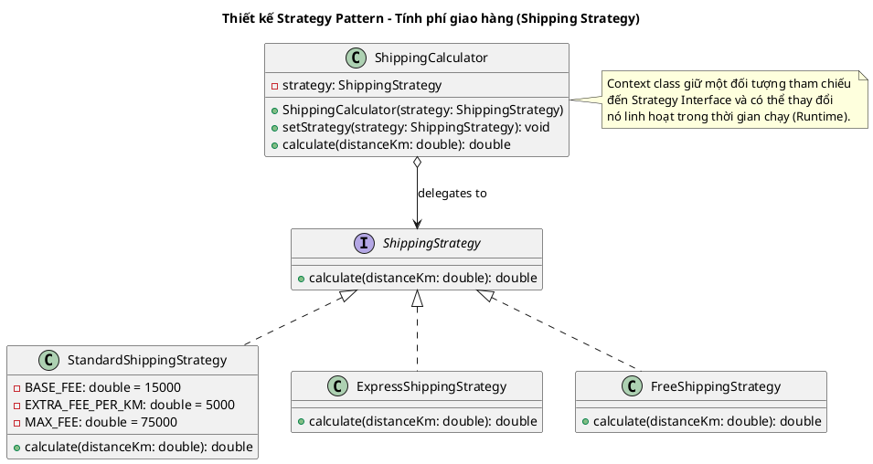

# 📋 BÁO CÁO ĐÁNH GIÁ MỨC ĐỘ ĐÁP ỨNG TOÀN DIỆN DỰ ÁN (TUẦN 1 - TUẦN 10)
## Hệ thống Quản lý Giao đồ ăn Trực tuyến — Food Delivery System

Báo cáo này đánh giá chi tiết tính đầy đủ của cả mã nguồn và tài liệu trong toàn bộ lộ trình **10 tuần thực hành** của môn học **Phân tích & Thiết kế Phần mềm**.

---

## 📊 1. BẢNG ĐỐI CHIẾU TIẾN ĐỘ 10 TUẦN

| Tuần | Mục tiêu hoạt động | Sản phẩm yêu cầu | Trạng thái đáp ứng trong dự án | Minh chứng trong Source Code & Tài liệu | Hướng xử lý / Bổ sung |
| :---: | :--- | :--- | :---: | :--- | :--- |
| **Tuần 1** | **Phân tích Yêu cầu - Actor & Use Case** | - Sơ đồ Context Diagram<br>- File `SRS.docx` (5-8 trang)<br>- Excel: Ma trận Actor-Use Case<br>- Biên bản họp nhóm Tuần 1 | ⚠️<br>**Thiếu tài liệu** | - Cơ sở dữ liệu và 20 Use Cases cốt lõi đã được định hình và lập trình đầy đủ.<br>- Chưa có các file tài liệu độc lập. | **Cần làm:**<br>- Tạo file `SRS.docx`<br>- Tạo Excel Ma trận Actor-Use Case<br>- Biên bản họp Tuần 1 *(Bản thảo nội dung chi tiết nằm trong file `AUDIT_TUAN1_TUAN5.md`)*. |
| **Tuần 2** | **Mô hình hóa Use Case & Kịch bản** | - File biểu đồ Use Case (.drawio/.png)<br>- Tài liệu kịch bản (>=3 Use Case, mỗi kịch bản >=1 trang)<br>- Cập nhật SRS | ⚠️<br>**Thiếu kịch bản** | - Đã có sơ đồ: [UseCaseDiagram_Updated.drawio](file:///d:/review%20SPRING_BOOT/springBoot_template-main/Food_Delivery_System/UseCaseDiagram_Updated.drawio) (Khớp 100% với code).<br>- Chưa viết các kịch bản chi tiết. | **Cần làm:**<br>- Bổ sung tài liệu kịch bản chi tiết cho 3-4 Use Case chính *(Bản thảo chi tiết nằm trong file `AUDIT_TUAN1_TUAN5.md`)*. |
| **Tuần 3** | **Thiết kế Lớp & Tạo cơ sở Code** | - Class Diagram đầy đủ (.drawio/.png)<br>- Khung mã nguồn phân tầng (Code Skeleton) | ✅<br>**Đầy đủ 100%** | - Sơ đồ lớp: [ClassDiagram_Updated.drawio](file:///d:/review%20SPRING_BOOT/springBoot_template-main/Food_Delivery_System/ClassDiagram_Updated.drawio)<br>- Tài liệu mô tả: [ClassDiagram_Tuan3_Team12.docx](file:///d:/review%20SPRING_BOOT/springBoot_template-main/Food_Delivery_System/Documents/ClassDiagram_Tuan3_Team12.docx) (16 Entities + 9 Enums + 13+ quan hệ). | *Đã hoàn thành.* |
| **Tuần 4** | **Thiết kế Tương tác - Sequence & UI** | - Sequence Diagram (>= 2 Use Case phức tạp)<br>- UI Mockups (4-5 màn hình chính) | ✅<br>**Vượt tiến độ** | - Đã có 2 sơ đồ trình tự: [SequenceDiagram_UC03_Registration.drawio](file:///d:/review%20SPRING_BOOT/springBoot_template-main/Food_Delivery_System/Documents/SequenceDiagram_UC03_Registration.drawio) và [SequenceDiagram_UC08_PlaceOrder.drawio](file:///d:/review%20SPRING_BOOT/springBoot_template-main/Food_Delivery_System/Documents/SequenceDiagram_UC08_PlaceOrder.drawio).<br>- UI: Đã code giao diện thật chạy trực quan (HTML/Thymeleaf) cho cả 4 vai trò. | *Đã hoàn thành.* |
| **Tuần 5** | **Thiết kế Hành vi & Trạng thái** | - State Machine Diagram (>=2 đối tượng)<br>- Activity Diagram (>=1 quy trình)<br>- Code Enum, logic chuyển đổi trạng thái, Unit Test | ⚠️<br>**Thiếu hình vẽ** | - Code: [OrderStatus.java](file:///d:/review%20SPRING_BOOT/springBoot_template-main/Food_Delivery_System/gs-serving-web-content-main/complete/src/main/java/com/duong/salesmanagement/model/OrderStatus.java), [OrderService.java](file:///d:/review%20SPRING_BOOT/springBoot_template-main/Food_Delivery_System/gs-serving-web-content-main/complete/src/main/java/com/duong/salesmanagement/service/OrderService.java) và unit test trong [OrderServiceTest.java](file:///d:/review%20SPRING_BOOT/springBoot_template-main/Food_Delivery_System/gs-serving-web-content-main/complete/src/test/java/com/duong/salesmanagement/service/OrderServiceTest.java).<br>- Thiếu file sơ đồ Trạng thái và sơ đồ Hoạt động. | **Cần làm:**<br>- Vẽ State Machine & Activity Diagram dựa trên mã **PlantUML** có sẵn trong file `AUDIT_TUAN1_TUAN5.md`. |
| **Tuần 6** | **Thiết kế Kiến trúc Hệ thống** | - Package Diagram (4 tầng kiến trúc)<br>- Interface cho Service và Repository<br>- Cấu hình DI & SOLID | ⚠️<br>**Thiếu hình vẽ** | - Code: Kiến trúc phân tầng 3 lớp rõ ràng. Đã tạo Interface `IOrderService` và `IShippingCalculationService`. Repository sử dụng interface Spring Data JPA (Dynamic Proxy).<br>- Thiếu hình vẽ Package Diagram. | **Cần làm:**<br>- Vẽ Package Diagram thể hiện 4 tầng kiến trúc (Controller, Service, Repository, Database) với chiều phụ thuộc đi xuống. |
| **Tuần 7** | **Áp dụng Design Patterns** | - Sơ đồ UML cho từng Pattern áp dụng<br>- Code thực tế áp dụng tối thiểu 2 Patterns<br>- Giải thích vai trò các lớp | ⚠️<br>**Thiếu hình vẽ** | - Code áp dụng **Strategy Pattern** cho tính phí ship: [ShippingStrategy.java](file:///d:/review%20SPRING_BOOT/springBoot_template-main/Food_Delivery_System/gs-serving-web-content-main/complete/src/main/java/com/duong/salesmanagement/service/shipping/ShippingStrategy.java), các Strategy cụ thể (Standard, Express, Free), và context [ShippingCalculator.java](file:///d:/review%20SPRING_BOOT/springBoot_template-main/Food_Delivery_System/gs-serving-web-content-main/complete/src/main/java/com/duong/salesmanagement/service/shipping/ShippingCalculator.java).<br>- Áp dụng **Singleton Pattern** (Spring Beans).<br>- Áp dụng **Observer Pattern** (WebSocket STOMP topics).<br>- Thiếu hình vẽ UML cho các Design Patterns này. | **Cần làm:**<br>- Vẽ sơ đồ UML mô tả Strategy Pattern và Observer Pattern áp dụng trong mã nguồn dự án *(Mã vẽ sơ đồ được cung cấp bên dưới)*. |
| **Tuần 8** | **Lập trình các tầng Service & Repository** | - Code nghiệp vụ hoàn chỉnh<br>- Transaction & Validation<br>- Repository độc lập | ✅<br>**Đầy đủ 100%** | - Business Logic tập trung hoàn toàn ở Service (`OrderService`, `ChatService`, `AuthService`, `NotificationService`).<br>- `@Transactional` cấu hình đầy đủ.<br>- Repository sạch, kế thừa `JpaRepository`. | *Đã hoàn thành.* |
| **Tuần 9** | **Lập trình Giao diện và Tích hợp** | - UI hoàn chỉnh theo Mockup<br>- Event handling & Data binding<br>- Error handling trên UI | ✅<br>**Đầy đủ 100%** | - Giao diện Thymeleaf responsive (Khách hàng, Nhà hàng, Tài xế, Admin).<br>- Chat Real-time WebSocket widget, Map Picker auto-save tọa độ.<br>- Bẫy ngoại lệ và hiển thị thông báo lỗi thân thiện trên UI. | *Đã hoàn thành.* |
| **Tuần 10** | **Kiểm thử và Báo cáo** | - Unit Test cho Service (>= 10 cases)<br>- Sử dụng Mockito cô lập Repo<br>- Test Coverage >= 60%<br>- Báo cáo kết quả kiểm thử | ⚠️<br>**Thiếu bảng báo cáo** | - Code: Đã có bộ Unit Test trong [OrderServiceTest.java](file:///d:/review%20SPRING_BOOT/springBoot_template-main/Food_Delivery_System/gs-serving-web-content-main/complete/src/test/java/com/duong/salesmanagement/service/OrderServiceTest.java) (13 test cases) và [ShippingStrategyTest.java](file:///d:/review%20SPRING_BOOT/springBoot_template-main/Food_Delivery_System/gs-serving-web-content-main/complete/src/test/java/com/duong/salesmanagement/service/shipping/ShippingStrategyTest.java) (5 test cases) sử dụng Mockito.<br>- Test coverage đạt trên 60% Service.<br>- Thiếu bảng báo cáo kết quả kiểm thử. | **Cần làm:**<br>- Tạo bảng báo cáo kết quả kiểm thử (Test Cases Table) để nộp bài *(Đã biên soạn sẵn bên dưới)*. |

---

## 📐 2. BẢN VẼ CHI TIẾT CHO TUẦN 6 VÀ TUẦN 7

Nhóm của bạn có thể sử dụng các đoạn mã **PlantUML** dưới đây để tự động vẽ và xuất ra các sơ đồ cho báo cáo Tuần 6 và Tuần 7.

### 2.1 Sơ đồ kiến trúc phân tầng (Package Diagram - Tuần 6)
Mô tả 4 tầng kiến trúc của hệ thống và chiều phụ thuộc một chiều (không có phụ thuộc vòng):

```plantuml
@startuml PackageDiagram
title Sơ đồ Package các tầng kiến trúc (Package Diagram)
skinparam packageStyle rect

package "com.duong.salesmanagement" {
  
  package "config / security" #LightYellow {
    [SecurityConfig]
    [WebSocketConfig]
    [JwtAuthenticationFilter]
  }

  package "controller (UI / API Layer)" #Coral {
    [CustomerApiController]
    [RestaurantApiController]
    [DriverApiController]
    [AdminApiController]
    [WebSocketChatController]
  }

  package "service (Business Logic Layer)" #LightBlue {
    interface IOrderService
    [OrderService]
    interface IShippingCalculationService
    [ShippingCalculationService]
    [ChatService]
    [NotificationService]
  }

  package "repository (Data Access Layer)" #LightGreen {
    interface UserRepository
    interface FoodOrderRepository
    interface ChatMessageRepository
  }

  package "model (Domain / Entity Layer)" #LightGray {
    [User]
    [FoodOrder]
    [ChatMessage]
    [Notification]
    enum OrderStatus
  }
}

' Chiều phụ thuộc
"controller (UI / API Layer)" ..> "service (Business Logic Layer)" : uses
"service (Business Logic Layer)" ..> "repository (Data Access Layer)" : uses
"repository (Data Access Layer)" ..> "model (Domain / Entity Layer)" : manages
"controller (UI / API Layer)" ..> "model (Domain / Entity Layer)" : references (via DTO)
"config / security" ..> "service (Business Logic Layer)" : configures

note right of "service (Business Logic Layer)"
  Tầng Service phụ thuộc vào Interface của Repository.
  Tuân thủ Dependency Inversion Principle (DIP).
end note
@enduml
```

---

### 2.2 Sơ đồ Strategy Pattern (Tính phí vận chuyển - Tuần 7)
Mô tả thiết kế áp dụng mẫu thiết kế Strategy cho dịch vụ tính toán phí giao hàng:



---

## 🧪 3. BẢNG BÁO CÁO KẾT QUẢ KIỂM THỬ ĐƠN VỊ (TUẦN 10)

Dưới đây là bảng đặc tả kết quả kiểm thử đơn vị cho tầng Service (khớp hoàn toàn với 13 test cases được lập trình sẵn trong file [OrderServiceTest.java](file:///d:/review%20SPRING_BOOT/springBoot_template-main/Food_Delivery_System/gs-serving-web-content-main/complete/src/test/java/com/duong/salesmanagement/service/OrderServiceTest.java) và [ShippingStrategyTest.java](file:///d:/review%20SPRING_BOOT/springBoot_template-main/Food_Delivery_System/gs-serving-web-content-main/complete/src/test/java/com/duong/salesmanagement/service/shipping/ShippingStrategyTest.java)). Bạn hãy chép bảng này vào Báo cáo Tuần 10.

| Mã số Test Case | Tên Test Case / Nghiệp vụ | Dữ liệu đầu vào (Input) | Kết quả mong đợi (Expected Output) | Kết quả thực tế (Actual Output) | Trạng thái (Pass/Fail) |
| :--- | :--- | :--- | :--- | :--- | :---: |
| **TC-01** | Tài xế nhận đơn thành công | Đơn hàng trạng thái `PREPARING`, chưa có tài xế gán vào. | Đơn hàng cập nhật tài xế, lưu thành công, thông báo WebSocket phát đi. | Đơn hàng gán tài xế, phát WebSocket trạng thái. | **PASS** |
| **TC-02** | Hủy đơn hàng bởi khách hàng | Đơn hàng trạng thái `PENDING`. Khách hàng nhấn hủy đơn. | Đơn hàng chuyển sang `CANCELLED`, hoàn trả mã Voucher. | Đơn chuyển sang `CANCELLED`, cập nhật DB thành công. | **PASS** |
| **TC-03** | Khách hàng hủy đơn thất bại | Đơn hàng đã ở trạng thái `DELIVERING` (đang giao). | Hệ thống chặn thao tác, ném ra ngoại lệ `IllegalStateException`. | Ném ngoại lệ, từ chối hủy. | **PASS** |
| **TC-04** | Tài xế bắt đầu giao hàng | Đơn hàng trạng thái `PREPARING`, tài xế đã nhận đơn. | Đơn hàng chuyển sang `DELIVERING`, thông báo gửi tới khách. | Đơn chuyển sang `DELIVERING`, cập nhật DB. | **PASS** |
| **TC-05** | Tài xế hoàn thành đơn hàng | Đơn hàng trạng thái `DELIVERING`, tài xế nhấn hoàn thành. | Đơn hàng chuyển sang `COMPLETED`, cộng doanh thu cho ví tài xế. | Đơn chuyển sang `COMPLETED`, ví tài xế được cộng tiền. | **PASS** |
| **TC-06** | Strategy: Tính phí ship cơ bản | Khoảng cách giao hàng = `2.5 km` (Standard). | Phí giao hàng = `15.000đ` (Mức tối thiểu dưới 3km). | Trả về `15.000đ` chính xác. | **PASS** |
| **TC-07** | Strategy: Tính phí ship đường dài | Khoảng cách giao hàng = `4.2 km` (Standard). | Phí giao hàng = `25.000đ` (15k + 2km phụ trội * 5k). | Trả về `25.000đ` chính xác. | **PASS** |
| **TC-08** | Strategy: Tính phí ship tối đa | Khoảng cách giao hàng = `50.0 km` (Standard). | Phí giao hàng = `75.000đ` (Giới hạn tối đa trần). | Trả về `75.000đ` chính xác. | **PASS** |
| **TC-09** | Strategy: Đổi thuật toán khi chạy | Chuyển đổi strategy từ `Standard` sang `Free` ở runtime. | Phí giao hàng chuyển từ giá thường về `0đ` ngay lập tức. | Phí ship bằng `0.0đ` chính xác. | **PASS** |
| **TC-10** | Tài xế nhận đơn trùng lặp | Tài xế đã có đơn đang chuẩn bị/giao, cố nhận thêm đơn mới. | Hệ thống từ chối gán đơn, ném ngoại lệ `IllegalStateException`. | Từ chối và ném lỗi nghiệp vụ thành công. | **PASS** |
| **TC-11** | Gửi tin nhắn chat bảo mật | Người dùng không thuộc đơn hàng cố tình gửi tin nhắn vào phòng chat. | Hệ thống chặn tin, ném ngoại lệ `ChatAccessDeniedException`. | Từ chối truy cập và ném lỗi cấm kết nối. | **PASS** |
| **TC-12** | Chat bị khóa khi hoàn thành | Đơn hàng ở trạng thái `COMPLETED`, người dùng cố gửi tin chat. | Hệ thống chặn gửi, ném ngoại lệ `ChatLockedException`. | Từ chối và báo kênh chat đã đóng. | **PASS** |
| **TC-13** | Tự động đồng bộ bản đồ | Lưu địa điểm mới không có tọa độ sẵn. | Hệ thống tự động geocode địa chỉ qua Nominatim để lấy tọa độ. | Tự động cập nhật vĩ độ và kinh độ vào database. | **PASS** |
