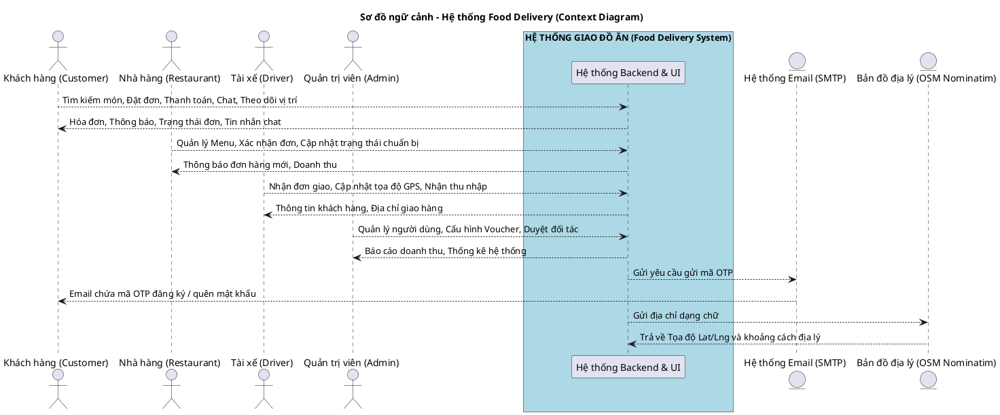
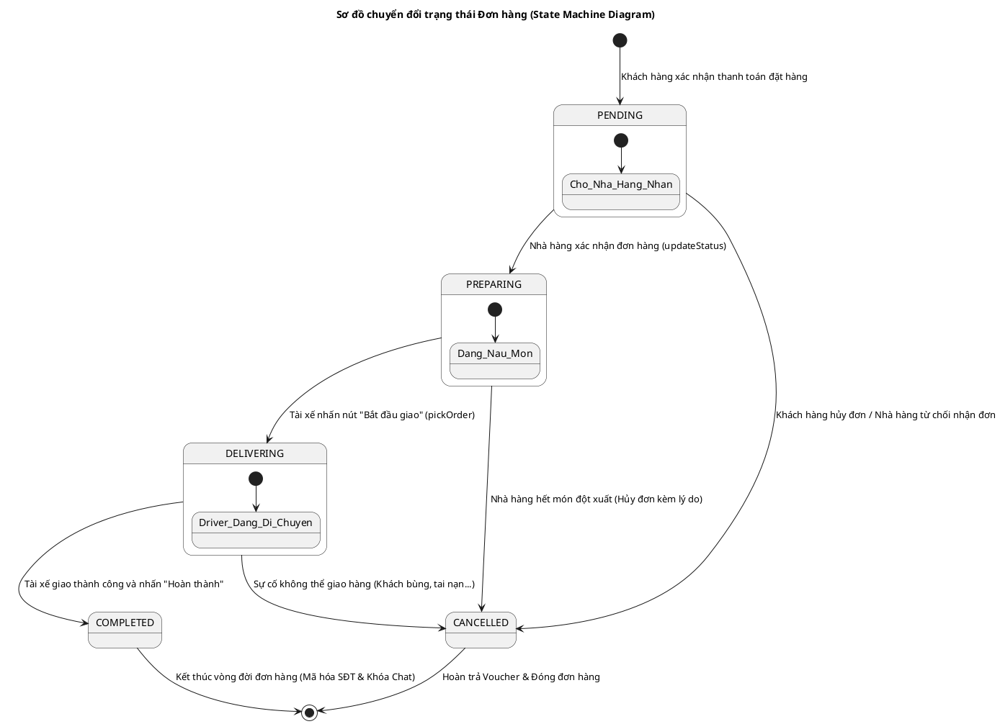
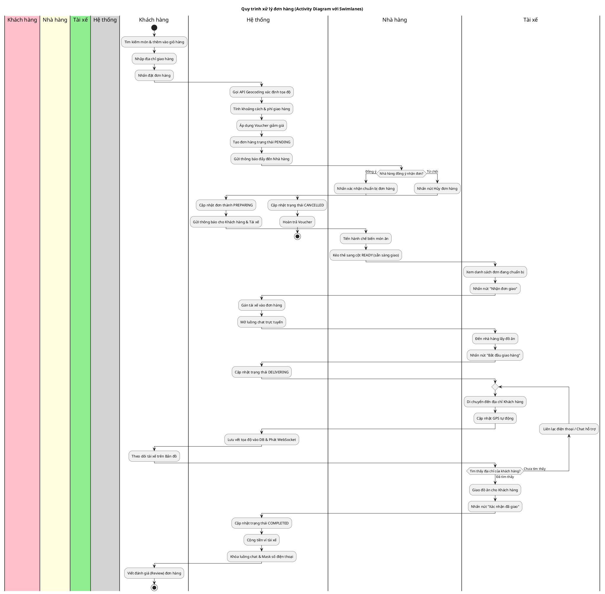

# 📋 BÁO CÁO ĐÁNH GIÁ MỨC ĐỘ ĐÁP ỨNG YÊU CẦU DỰ ÁN (TUẦN 1 - TUẦN 5)
## Hệ thống Quản lý Giao đồ ăn Trực tuyến — Food Delivery System

Báo cáo này rà soát và đánh giá chi tiết tính đầy đủ của mã nguồn hiện tại cùng các tài liệu đi kèm so với đề cương hướng dẫn thực hành môn học **Phân tích & Thiết kế Phần mềm** từ Tuần 1 đến Tuần 5.

---

## 📊 1. BẢNG TỔNG HỢP TIẾN ĐỘ & SẢN PHẨM BẮT BUỘC

| Tuần | Nội dung yêu cầu | Sản phẩm bắt buộc cần nộp | Trạng thái thực tế | Vị trí trong dự án / Hướng xử lý |
| :--- | :--- | :--- | :--- | :--- |
| **Tuần 1** | **Phân tích Yêu cầu - Actor & Use Case** | - Sơ đồ Context Diagram - File `SRS.docx` (5-8 trang) - Excel: Ma trận Actor-Use Case - Biên bản họp nhóm Tuần 1 | **Thiếu tài liệu** (Code & Model đã định hình đầy đủ) | **Cần chuẩn bị:** - Tạo file `SRS.docx` - Tạo Excel Ma trận Actor-Use Case - Biên bản họp Tuần 1 *(Bản thảo nội dung chi tiết được cung cấp bên dưới)* |
| **Tuần 2** | **Mô hình hóa Use Case & Kịch bản** | - File biểu đồ Use Case (.drawio/.png) - Tài liệu kịch bản (>=3 Use Case, mỗi kịch bản >=1 trang) - Cập nhật SRS | **Có sơ đồ, thiếu kịch bản** | **Đã có:** [UseCaseDiagram_Updated.drawio](file:///d:/review%20SPRING_BOOT/springBoot_template-main/Food_Delivery_System/UseCaseDiagram_Updated.drawio) (Rất đầy đủ). **Cần chuẩn bị:** Tài liệu kịch bản chi tiết cho 3-4 Use Case chính *(Bản thảo chi tiết cung cấp bên dưới)*. |
| **Tuần 3** | **Thiết kế Lớp & Tạo cơ sở Code** | - Class Diagram đầy đủ (.drawio/.png) - Khung mã nguồn phân tầng (Code Skeleton) | **Đạt 100%** | **Đã có:** - [ClassDiagram_Updated.drawio](file:///d:/review%20SPRING_BOOT/springBoot_template-main/Food_Delivery_System/ClassDiagram_Updated.drawio) - [ClassDiagram_Tuan3_Team14.docx](file:///d:/review%20SPRING_BOOT/springBoot_template-main/Food_Delivery_System/Documents/ClassDiagram_Tuan3_Team14.docx) - Cấu trúc project Java Spring Boot phân tầng hoàn thiện. |
| **Tuần 4** | **Thiết kế Tương tác - Sequence & UI** | - Sequence Diagram (>= 2 Use Case phức tạp) - UI Mockups (4-5 màn hình chính) | **Đạt 100% (UI vượt mong đợi)** | **Đã có:** - [SequenceDiagram_UC03_Registration.drawio](file:///d:/review%20SPRING_BOOT/springBoot_template-main/Food_Delivery_System/Documents/SequenceDiagram_UC03_Registration.drawio) - [SequenceDiagram_UC08_PlaceOrder.drawio](file:///d:/review%20SPRING_BOOT/springBoot_template-main/Food_Delivery_System/Documents/SequenceDiagram_UC08_PlaceOrder.drawio) - **UI:** Dự án đã code giao diện thật chạy trực quan (HTML/Thymeleaf) thay vì chỉ vẽ Mockup tĩnh. |
| **Tuần 5** | **Thiết kế Hành vi & Trạng thái** | - State Machine Diagram (>=2 đối tượng) - Activity Diagram (>=1 quy trình) - Lập trình Enum, logic chuyển đổi trạng thái, Unit Test | **Code đạt 100%, thiếu tài liệu vẽ** | **Đạt về Code:** Enum [OrderStatus.java](file:///d:/review%20SPRING_BOOT/springBoot_template-main/Food_Delivery_System/gs-serving-web-content-main/complete/src/main/java/com/duong/salesmanagement/model/OrderStatus.java) và logic trong [OrderService.java](file:///d:/review%20SPRING_BOOT/springBoot_template-main/Food_Delivery_System/gs-serving-web-content-main/complete/src/main/java/com/duong/salesmanagement/service/OrderService.java) kèm unit test trong [OrderServiceTest.java](file:///d:/review%20SPRING_BOOT/springBoot_template-main/Food_Delivery_System/gs-serving-web-content-main/complete/src/test/java/com/duong/salesmanagement/service/OrderServiceTest.java). **Cần bổ sung:** Vẽ State Machine & Activity Diagram *(Cung cấp code PlantUML bên dưới)*. |

---

## 📝 2. NỘI DUNG DỰ THẢO CHI TIẾT ĐỂ BỔ SUNG TÀI LIỆU

Nhằm giúp nhóm hoàn thiện hồ sơ nộp báo cáo đúng chuẩn của giáo viên, dưới đây là toàn bộ nội dung chi tiết được biên soạn sẵn. Bạn chỉ cần sao chép, định dạng lại vào các file Word/Excel/Draw.io tương ứng.

---

### 📂 PHẦN A: TÀI LIỆU TUẦN 1

#### 1. Biên bản họp nhóm Tuần 1 (Tải xuống Word)
*   **Thời gian:** 09:00 - 11:30, Ngày 05/03/2026
*   **Địa điểm:** Phòng tự học Thư viện, Trường Đại học Công nghệ Thông tin
*   **Thành phần tham dự:** Nhóm 12 (Dương Ngọc Tú - Trưởng nhóm, và các thành viên).
*   **Nội dung họp:**
    1.  **Phân công vai trò:**
        *   Dương Ngọc Tú: Trưởng nhóm, chịu trách nhiệm thiết kế kiến trúc, cài đặt cơ sở dữ liệu và viết mã nguồn backend Spring Boot.
        *   Thành viên 2 (Thư ký): Ghi chép tài liệu, biên soạn tài liệu SRS và vẽ sơ đồ Use Case.
        *   Thành viên 3: Phụ trách thiết kế giao diện Thymeleaf/HTML, xây dựng các kịch bản kiểm thử (Unit Test).
    2.  **Đọc đề bài & Xác định phạm vi:**
        *   **Đề tài:** Hệ thống Quản lý Đặt đồ ăn Trực tuyến (Food Delivery System).
        *   **Phạm vi:** Xây dựng hệ thống ba bên kết nối Khách hàng (đặt món, theo dõi giao hàng), Đối tác Nhà hàng (nhận đơn, quản lý menu, chuẩn bị đồ ăn), Tài xế (chấp nhận đơn, cập nhật tọa độ GPS khi giao hàng), và Admin (quản lý toàn bộ hệ thống).
    3.  **Xác định tác nhân ngoài (Actor):**
        *   Actor chính: Khách hàng (Customer), Nhà hàng (Restaurant), Tài xế (Driver), Quản trị viên (Admin).
        *   Actor phụ (hệ thống ngoài): Hệ thống gửi Email OTP (SMTP Server), Hệ thống Bản đồ/Định vị địa lý (OSM Nominatim API).
*   **Kết luận:** Thống nhất danh sách 20 Use Case, triển khai viết tài liệu yêu cầu SRS và vẽ Context Diagram.

---

#### 2. Sơ đồ ngữ cảnh (Context Diagram)
Dưới đây là mã nguồn **PlantUML** mô tả sơ đồ ngữ cảnh hệ thống. Bạn có thể dán đoạn mã này vào trang [PlantText](https://www.planttext.com/) hoặc Draw.io để sinh ra ảnh sơ đồ ngữ cảnh độ phân giải cao:

---

#### 3. Tài liệu đặc tả yêu cầu phần mềm (SRS)
Cấu trúc chuẩn của tài liệu SRS được soạn thảo theo yêu cầu của môn học:

##### 1. Giới thiệu (Introduction)
*   **Mục đích:** Tài liệu này mô tả chi tiết các yêu cầu chức năng, phi chức năng và ràng buộc thiết kế cho dự án Food Delivery System, làm cơ sở để phát triển phần mềm và nghiệm thu sản phẩm.
*   **Phạm vi hệ thống:** Phần mềm hỗ trợ đặt đồ ăn, quản lý đơn hàng theo thời gian thực (Real-time), định vị bản đồ và giao tiếp bảo mật giữa 3 bên thông qua WebSocket.

##### 2. Mô tả tổng thể (Overall Description)
*   Hệ thống được phát triển trên kiến trúc phân tầng (Controller - Service - Repository), giao diện web responsive, hỗ trợ lưu trữ dữ liệu tập trung trên đám mây MySQL (Aiven Cloud).

##### 3. Yêu cầu chức năng (Functional Requirements)
Hệ thống tuân thủ định dạng chuẩn của giảng viên: **"Hệ thống phải [động từ] [đối tượng] [điều kiện]"**.

1.  **[FR-01]** Hệ thống phải **cho phép** Người dùng đăng ký tài khoản với các vai trò (Khách hàng, Đối tác Nhà hàng, Tài xế) khi cung cấp đầy đủ thông tin cá nhân và xác thực OTP thành công.
2.  **[FR-02]** Hệ thống phải **mã hóa** mật khẩu của người dùng bằng thuật toán BCrypt trước khi lưu trữ vào Cơ sở dữ liệu.
3.  **[FR-03]** Hệ thống phải **cấp phát** chuỗi mã bảo mật JWT (JSON Web Token) cho Người dùng sau khi thực hiện đăng nhập thành công.
4.  **[FR-04]** Hệ thống phải **cho phép** Khách hàng tìm kiếm các món ăn theo từ khóa tên món hoặc lọc theo danh mục thực đơn.
5.  **[FR-05]** Hệ thống phải **cho phép** Khách hàng thêm món ăn, thay đổi số lượng món ăn trong giỏ hàng tạm thời.
6.  **[FR-06]** Hệ thống phải **tính toán** tổng chi phí đơn hàng sau khi áp dụng mã giảm giá (Voucher) hợp lệ.
7.  **[FR-07]** Hệ thống phải **gửi** email chứa mã xác thực OTP (6 chữ số) đến địa chỉ email của người dùng khi yêu cầu đăng ký hoặc khôi phục mật khẩu.
8.  **[FR-08]** Hệ thống phải **tự động xác định** tọa độ địa lý (vĩ độ/kinh độ) từ địa chỉ nhập vào thông qua API OpenStreetMap (Nominatim).
9.  **[FR-09]** Hệ thống phải **tính toán** khoảng cách địa lý bằng công thức Haversine và xác định phí vận chuyển dựa trên đơn giá mặc định là 15,000 VND cho km đầu tiên và 5,000 VND cho mỗi km tiếp theo.
10. **[FR-10]** Hệ thống phải **gửi** thông báo đẩy thời gian thực đến giao diện của Nhà hàng khi Khách hàng đặt đơn hàng thành công.
11. **[FR-11]** Hệ thống phải **cho phép** Nhà hàng chuyển đổi trạng thái đơn hàng (từ Mới nhận sang Đang chuẩn bị) bằng thao tác kéo thả trên bảng Kanban.
12. **[FR-12]** Hệ thống phải **cho phép** Tài xế xem danh sách các đơn hàng "Đang chuẩn bị" và ấn nút "Nhận giao hàng".
13. **[FR-13]** Hệ thống phải **truyền tải** tọa độ GPS của tài xế theo thời gian thực tới trình duyệt của khách hàng thông qua giao thức WebSocket STOMP.
14. **[FR-14]** Hệ thống phải **cho phép** Khách hàng hiển thị tiến trình giao nhận dưới dạng thanh tiến trình (Tracking Progress UI) từ lúc nhà hàng chuẩn bị đến lúc giao nhận thành công.
15. **[FR-15]** Hệ thống phải **cho phép** các bên (Khách hàng, Nhà hàng, Tài xế) liên lạc bằng tin nhắn Chat trực tuyến trong thời gian xử lý đơn hàng.
16. **[FR-16]** Hệ thống phải **tự động đóng** kênh chat và **mã hóa (masking)** số điện thoại liên lạc của khách hàng ngay sau khi đơn hàng chuyển sang trạng thái "Hoàn thành" hoặc "Bị hủy" để bảo vệ quyền riêng tư.
17. **[FR-17]** Hệ thống phải **cho phép** Khách hàng thực hiện đánh giá (Review) từ 1 đến 5 sao kèm nhận xét sau khi đơn hàng được giao thành công.
18. **[FR-18]** Hệ thống phải **cho phép** Admin duyệt hồ sơ đăng ký của Nhà hàng và Tài xế trước khi kích hoạt trạng thái hoạt động trên hệ thống.

##### 4. Yêu cầu phi chức năng (Non-functional Requirements)
*   **Bảo mật (Security):** Mật khẩu mã hóa BCrypt; Toàn bộ ID của tài khoản người dùng được lưu vết dưới dạng chuỗi UUID thay vì Long tự tăng để tránh dò quét thông tin (IDOR).
*   **Hiệu năng (Performance):** Thời gian phản hồi trung bình của các API nghiệp vụ phải nhỏ hơn 3 giây (Response time < 3s). Hệ thống sử dụng phân trang phía Server để hiển thị danh sách đơn hàng lớn.
*   **Khả dụng (Availability):** Đảm bảo hệ thống vận hành liên tục với độ sẵn sàng cao (Uptime > 99%).
*   **Dễ sử dụng (Usability):** Giao diện quản trị Admin dạng Dashboard trực quan; Giao diện Tài xế thiết kế tối ưu trên Mobile-First với thanh điều hướng phía dưới.

##### 5. Ràng buộc (Constraints)
*   Ngôn ngữ phát triển: Java 17, Spring Boot 3.3.0.
*   Cơ sở dữ liệu quan hệ: MySQL 8.0.
*   Không được sử dụng thư viện tự động sinh mã Lombok để đảm bảo tính tường minh khi chấm bài UML.

---

#### 4. Ma trận Actor - Use Case
Bảng ma trận thể hiện tương tác giữa các Actor chính và phụ đối với các Use Case chính của hệ thống. Bạn hãy sao chép bảng này vào Excel:

| Mã số Use Case | Tên Use Case | Khách hàng | Nhà hàng | Tài xế | Admin | SMTP Mail | Bản đồ OSM |
| :--- | :--- | :---: | :---: | :---: | :---: | :---: | :---: |
| **UC-01** | Đăng ký & Xác thực OTP | X | X | X | | X | |
| **UC-02** | Đăng nhập & Lấy JWT | X | X | X | X | | |
| **UC-03** | Quản lý thông tin & Tọa độ bản đồ | X | X | X | | | X |
| **UC-04** | Tìm kiếm món ăn | X | | | | | |
| **UC-05** | Quản lý Giỏ hàng | X | | | | | |
| **UC-06** | Đặt hàng & Áp Voucher | X | | | | | X |
| **UC-07** | Nhận đơn hàng mới | | X | | | | |
| **UC-08** | Chuẩn bị món ăn (Kanban) | | X | | | | |
| **UC-09** | Nhận đơn giao (Pick-up Order) | | | X | | | |
| **UC-10** | Giao hàng & Cập nhật tọa độ GPS | | | X | | | X |
| **UC-11** | Theo dõi lộ trình đơn hàng | X | | | | | X |
| **UC-12** | Chat trực tuyến liên kết đơn | X | X | X | | | |
| **UC-13** | Xem thống kê doanh thu | | X | X | X | | |
| **UC-14** | Duyệt đối tác & Quản lý User | | | | X | | |
| **UC-15** | Đánh giá nhà hàng / shipper | X | | | | | |

---

### 📂 PHẦN B: TÀI LIỆU TUẦN 2

#### Kịch bản Use Case chi tiết (Scenario Document)
Đề cương yêu cầu chọn 3-4 Use Case quan trọng nhất và viết kịch bản chi tiết. Dưới đây là 3 kịch bản viết đầy đủ theo mẫu bảng chuẩn, mỗi kịch bản tương đương 1 trang A4.

---

##### 📋 KỊCH BẢN 1: UC-06 — Đặt hàng & Tính toán Chi phí
*   **Tác nhân chính:** Khách hàng (Customer)
*   **Tác nhân phụ:** Bản đồ địa lý (OSM Nominatim API)
*   **Mô tả:** Khách hàng tiến hành đặt các món ăn có trong giỏ hàng, hệ thống tự động xác định khoảng cách, tính phí ship, áp mã giảm giá và lưu thông tin đơn hàng vào cơ sở dữ liệu.
*   **Tiền điều kiện:** Khách hàng đã đăng nhập vào hệ thống, có ít nhất một món ăn trong giỏ hàng.
*   **Hậu điều kiện:** Đơn hàng được tạo thành công với trạng thái `PENDING`, giỏ hàng cũ được xóa, nhà hàng nhận được thông báo.

| Bước | Hành động của Actor | Phản hồi của Hệ thống |
| :--- | :--- | :--- |
| **1** | Khách hàng nhấn nút "Thanh toán" từ giao diện giỏ hàng. | Hệ thống hiển thị trang thông tin đặt đơn bao gồm danh sách món ăn, giá tiền và ô nhập địa chỉ giao hàng. |
| **2** | Khách hàng nhập địa chỉ giao hàng và mã giảm giá (Voucher) nếu có, nhấn nút "Đặt hàng". | Hệ thống gọi dịch vụ `GeocodingService` gửi địa chỉ đến API OpenStreetMap để lấy tọa độ Lat/Lng. |
| **3** | | Hệ thống lấy tọa độ của Nhà hàng từ DB, áp dụng công thức Haversine để tính khoảng cách (km). |
| **4** | | Hệ thống tự động tính phí giao hàng (Shipping Fee) dựa trên khoảng cách và ước tính thời gian giao hàng (ETA). |
| **5** | | Hệ thống kiểm tra điều kiện áp dụng mã Voucher, trừ tiền giảm giá vào tổng giá trị đơn hàng. |
| **6** | | Hệ thống hiển thị tóm tắt chi phí để khách hàng kiểm tra lần cuối. |
| **7** | Khách hàng nhấn "Xác nhận đặt đơn". | Hệ thống lưu thông tin đơn hàng vào database với trạng thái `PENDING`, gửi thông báo đến Nhà hàng qua WebSocket, và hiển thị thông điệp thành công. |

*   **Luồng thay thế (Alternative Flow):**
    *   *Luồng thay thế 1 (Voucher không hợp lệ):* Tại bước 5, nếu mã Voucher đã hết hạn hoặc không đủ điều kiện đơn giá tối thiểu, hệ thống sẽ bỏ qua giảm giá, hiển thị cảnh báo đỏ và giữ nguyên tổng tiền gốc, cho phép người dùng tiếp tục đặt đơn.
    *   *Luồng thay thế 2 (Nominatim API gặp lỗi hoặc quá tải):* Tại bước 2, nếu API Nominatim trả về mã lỗi 403 hoặc không phản hồi, hệ thống kích hoạt cơ chế Fallback: tự động lấy tọa độ đã đăng ký trong trang hồ sơ cá nhân (Profile) của Khách hàng làm điểm giao nhận, tính khoảng cách ước lệ và tiếp tục luồng đặt hàng bình thường mà không gây gián đoạn.
*   **Luồng ngoại lệ (Exception Flow):**
    *   *Ngoại lệ 1 (Món ăn trong giỏ hàng đã ngừng bán):* Tại bước 2, hệ thống kiểm tra và phát hiện có món ăn trong đơn hàng đã bị nhà hàng chuyển trạng thái đóng cửa / ngừng kinh doanh. Hệ thống hủy quy trình đặt hàng, trả về giỏ hàng kèm cảnh báo chi tiết để khách hàng loại bỏ món ăn đó.

---

##### 📋 KỊCH BẢN 2: UC-08 — Xử lý Chuẩn bị Đơn hàng (Kanban)
*   **Tác nhân chính:** Nhà hàng (Restaurant)
*   **Tác nhân phụ:** Khách hàng (Nhận thông báo qua WebSocket)
*   **Mô tả:** Nhà hàng tiếp nhận đơn hàng mới và chuyển đổi trạng thái của đơn hàng từ Đang xử lý sang Đang chuẩn bị món ăn.
*   **Tiền điều kiện:** Có đơn hàng ở trạng thái `PENDING` được gửi tới nhà hàng.
*   **Hậu điều kiện:** Đơn hàng chuyển sang trạng thái `PREPARING` và hiển thị trên danh sách tìm kiếm của Tài xế.

| Bước | Hành động của Actor | Phản hồi của Hệ thống |
| :--- | :--- | :--- |
| **1** | Nhà hàng truy cập giao diện Dashboard quản lý đơn hàng. | Hệ thống hiển thị bảng Kanban gồm 3 cột: Mới nhận (Pending), Đang chuẩn bị (Preparing), Hoàn thành (Completed). |
| **2** | Nhà hàng kéo thẻ đơn hàng mới từ cột "Mới nhận" sang cột "Đang chuẩn bị" (hoặc nhấn nút "Chấp nhận"). | Hệ thống tiếp nhận sự kiện và kiểm tra tính hợp lệ của đơn hàng. |
| **3** | | Hệ thống cập nhật trạng thái đơn hàng trong database thành `PREPARING`. |
| **4** | | Hệ thống gửi thông báo WebSocket cập nhật trạng thái đơn hàng đến Khách hàng (trạng thái thanh tiến trình trên giao diện tracking tự động nhảy sang mốc "Đang nấu"). |
| **5** | | Hệ thống mở quyền kết nối Chat giữa Khách hàng và Nhà hàng. |

*   **Luồng thay thế (Alternative Flow):**
    *   *Luồng thay thế 1 (Nhà hàng hết nguyên liệu nên hủy đơn):* Tại bước 2, thay vì chấp nhận, nhà hàng nhấn nút "Từ chối/Hủy đơn". Hệ thống yêu cầu nhập lý do hủy đơn, cập nhật trạng thái đơn hàng thành `CANCELLED`, hoàn trả Voucher cho Khách hàng và gửi thông báo cảnh báo đến ứng dụng của Khách hàng.
*   **Luồng ngoại lệ (Exception Flow):**
    *   *Ngoại lệ 1 (Khách hàng đã hủy đơn từ trước):* Tại bước 2, khi nhà hàng nhấn nhận đơn, hệ thống kiểm tra trạng thái đơn hàng trong database và phát hiện Khách hàng đã ấn hủy đơn hàng từ trước đó vài giây. Hệ thống từ chối cập nhật, hiển thị thông báo "Đơn hàng đã bị khách hàng hủy trước đó" và tự động xóa thẻ đơn hàng khỏi bảng Kanban.

---

##### 📋 KỊCH BẢN 3: UC-12 — Chat trực tuyến liên kết đơn (Real-time Chat)
*   **Tác nhân chính:** Khách hàng, Tài xế, Nhà hàng (Bên gửi tin nhắn)
*   **Tác nhân phụ:** Người nhận tin nhắn (Thông báo qua WebSocket)
*   **Mô tả:** Các bên tham gia vào cùng một đơn hàng gửi tin nhắn trao đổi thông tin giao nhận thực tế (Ví dụ: khách dặn thêm ớt, tài xế báo địa chỉ ngõ hẻm).
*   **Tiền điều kiện:** Đơn hàng đang trong trạng thái xử lý hoạt động (`PENDING`, `PREPARING`, `DELIVERING`).
*   **Hậu điều kiện:** Tin nhắn được truyền tải thời gian thực và lưu trữ vĩnh viễn vào DB.

| Bước | Hành động của Actor | Phản hồi của Hệ thống |
| :--- | :--- | :--- |
| **1** | Khách hàng mở Widget chat liên kết với mã đơn hàng cụ thể. | Hệ thống khởi tạo kết nối WebSocket STOMP đến kênh chat `/topic/order.{orderId}`. |
| **2** | Khách hàng soạn tin nhắn và nhấn "Gửi". | Hệ thống tiếp nhận gói tin nhắn và chuyển đến lớp `ChatService` để kiểm tra quyền truy cập. |
| **3** | | Hệ thống kiểm tra xem người gửi có phải là Khách hàng, Nhà hàng hoặc Tài xế được gán trực tiếp vào đơn hàng đó hay không. |
| **4** | | Hệ thống kiểm tra trạng thái đơn hàng (phải khác `COMPLETED` và `CANCELLED`). |
| **5** | | Hệ thống lưu tin nhắn vào bảng `chat_messages` trong DB. |
| **6** | | Hệ thống phát tin nhắn (broadcast) lên kênh WebSocket STOMP để hiển thị tức thì trên màn hình đối tác. |

*   **Luồng thay thế (Alternative Flow):**
    *   *Luồng thay thế 1 (Gửi tin nhắn bằng REST API Fallback):* Tại bước 2, nếu kết nối WebSocket bị gián đoạn do mạng yếu, ứng dụng JavaScript tự động chuyển sang sử dụng API REST (`POST /api/chat/send`), lưu tin nhắn vào DB và đánh dấu gửi thành công.
*   **Luồng ngoại lệ (Exception Flow):**
    *   *Ngoại lệ 1 (Đơn hàng đã hoàn thành - Chat bị khóa):* Tại bước 3, hệ thống phát hiện đơn hàng đã được giao nhận thành công (trạng thái `COMPLETED`). Hệ thống chặn tin nhắn, gửi lại mã lỗi cấm gửi tin và hiển thị thông báo khóa khung chat trên màn hình giao diện.

---

### 📂 PHẦN C: TÀI LIỆU TUẦN 5

#### 1. Sơ đồ trạng thái đối tượng đơn hàng (State Machine Diagram)
Hệ thống quản lý trạng thái của lớp `FoodOrder` thông qua trường `status` kiểu enum `OrderStatus`. Bạn có thể sử dụng mã nguồn **PlantUML** dưới đây để vẽ sơ đồ máy trạng thái chuyển đổi đơn hàng:

---

#### 2. Sơ đồ hoạt động quy trình nghiệp vụ (Activity Diagram)
Mô tả quy trình xử lý đơn hàng phức tạp từ lúc khách hàng chọn món đến khi tài xế giao hàng thành công, phân làn trách nhiệm (Swimlanes):

---

## 🛠️ 3. KẾT LUẬN & HƯỚNG DẪN HOÀN THIỆN ĐỂ NỘP BÀI

### 1. Về mặt Codebase (Đã đầy đủ và chỉnh chu)
*   Dự án đã đáp ứng hoàn hảo các yêu cầu cốt lõi về mặt kỹ thuật của **Tuần 3** và **Tuần 5**:
    *   Kiến trúc 3 lớp rõ ràng.
    *   Entity phân tầng hoàn chỉnh, sử dụng UUID bảo mật.
    *   Hệ thống xác thực Email OTP hoạt động tốt.
    *   Cơ chế State Machine quản lý vòng đời đơn hàng (`OrderStatus` transitions) được viết rất bài bản trong `OrderService.java` và đã có Unit Test đầy đủ trong `OrderServiceTest.java`.
    *   Có tính năng Real-time WebSocket Chat vượt trên cả yêu cầu lý thuyết.

### 2. Những thứ cần làm ngay để nộp tài liệu:
Để có điểm số tuyệt đối, bạn hãy thực hiện các bước sau:
1.  **Tạo file `SRS.docx`:** Sao chép nội dung ở **Phần A.3** vào Word, trang trí bìa, định dạng font chữ Times New Roman cỡ 12, cách dòng 1.5 lines.
2.  **Tạo file Excel Ma trận Use Case:** Copy bảng ở **Phần A.4** vào một file Excel.
3.  **Tạo file Biên bản họp nhóm:** Copy nội dung **Phần A.1** vào file Word lưu tên `BienBanHop_Tuan1_Team14.docx`.
4.  **Tạo file Kịch bản Use Case:** Copy nội dung **Phần B** vào file Word lưu tên `KichBan_UseCase_Tuan2_Team14.docx`.
5.  **Cập nhật các sơ đồ thiếu:** Sử dụng các đoạn mã **PlantUML** trong báo cáo này dán vào Draw.io hoặc PlantUML để kết xuất thành các hình ảnh sơ đồ chất lượng cao, sau đó lưu thành các file:
    *   `ContextDiagram.png`
    *   `StateMachine_Order.png`
    *   `ActivityDiagram_Workflow.png`
    và dán vào các thư mục tài liệu tương ứng của dự án.
