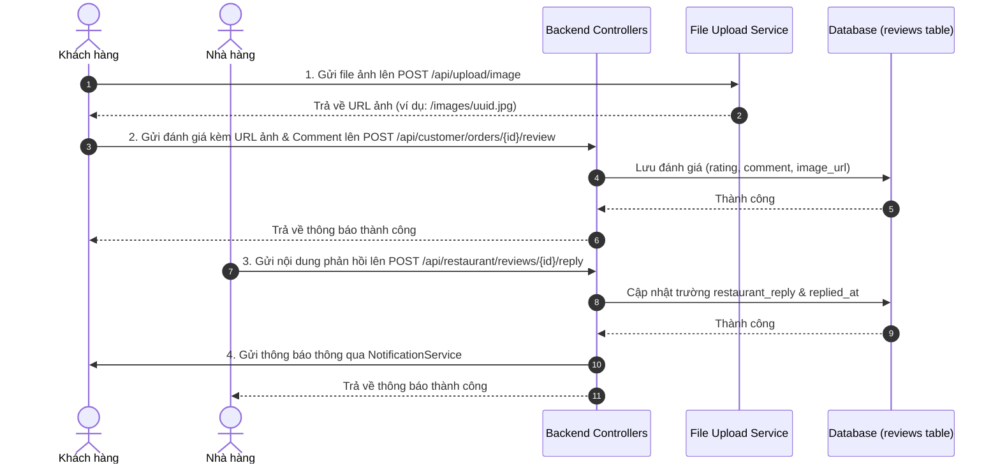

# 📚 HƯỚNG DẪN CHI TIẾT TÍNH NĂNG: UPLOAD ẢNH ĐÁNH GIÁ & NHÀ HÀNG PHẢN HỒI

Tài liệu này hướng dẫn chi tiết cách triển khai tính năng **Tải ảnh lên khi Đánh giá** (dành cho Khách hàng) và **Phản hồi Đánh giá** (dành cho Nhà hàng) trong dự án **Food Delivery System**.

---

## 🗺️ 1. SƠ ĐỒ LUỒNG HOẠT ĐỘNG (FLOW OF DATA)



---

## 🛠️ 2. CHI TIẾT CÁC THAY ĐỔI TRONG CODEBASE

### 📂 A. Thiết kế Cơ sở dữ liệu & Entity

Chúng ta bổ sung thêm 3 trường mới vào Entity [Review.java](file:///d:/review SPRING_BOOT/springBoot_template-main/Food_Delivery_System/gs-serving-web-content-main/complete/src/main/java/com/duong/salesmanagement/model/Review.java) để lưu trữ ảnh đánh giá, nội dung phản hồi của nhà hàng và thời gian phản hồi:

```java
// Thêm các trường vào Entity Review
private String imageUrl;        // URL ảnh đánh giá của khách hàng
private String restaurantReply; // Nội dung phản hồi của nhà hàng
private LocalDateTime repliedAt;// Thời gian nhà hàng phản hồi
```
> [!NOTE]
> Hệ thống sử dụng cơ chế `spring.jpa.hibernate.ddl-auto=update` nên khi khởi động ứng dụng, Hibernate sẽ tự động tạo thêm 3 cột tương ứng (`image_url`, `restaurant_reply`, `replied_at`) vào bảng `reviews` của cơ sở dữ liệu MySQL mà không cần chạy SQL bằng tay.

---

### 📂 B. Tầng Business Logic (Service Layer)

1. **Cập nhật Interface [IOrderService.java](file:///d:/review SPRING_BOOT/springBoot_template-main/Food_Delivery_System/gs-serving-web-content-main/complete/src/main/java/com/duong/salesmanagement/service/IOrderService.java)**:
   Thay đổi chữ ký (signature) của hàm `reviewOrder` để nhận thêm tham số `imageUrl`:
   ```java
   Review reviewOrder(Long orderId, CustomerProfile customer, int rating, String comment, String imageUrl);
   ```

2. **Cập nhật Implement [OrderService.java](file:///d:/review SPRING_BOOT/springBoot_template-main/Food_Delivery_System/gs-serving-web-content-main/complete/src/main/java/com/duong/salesmanagement/service/OrderService.java)**:
   Lưu ảnh đánh giá vào đối tượng `Review` trước khi lưu xuống database:
   ```java
   review.setImageUrl(imageUrl);
   ```

3. **Thêm thông báo phản hồi vào [NotificationService.java](file:///d:/review SPRING_BOOT/springBoot_template-main/Food_Delivery_System/gs-serving-web-content-main/complete/src/main/java/com/duong/salesmanagement/service/NotificationService.java)**:
   Định nghĩa hàm để gửi thông báo đến Khách hàng khi có phản hồi mới từ nhà hàng:
   ```java
   @Transactional
   public void notifyRestaurantReplied(User customerUser, Long orderId) {
       createNotification(customerUser,
               "💬 Phản hồi đánh giá mới!",
               "Nhà hàng đã phản hồi đánh giá của bạn cho đơn #" + orderId + ".",
               NotificationType.NEW_REVIEW, orderId);
   }
   ```

---

### 📂 C. Tầng Điều hướng API (Controller Layer)

1. **Khách hàng (`CustomerApiController.java`)**:
   - Thêm trường `public String imageUrl;` vào class DTO static `ReviewRequest`.
   - Cập nhật hàm `reviewOrder` để lấy `imageUrl` từ body payload và chuyển tiếp tới `orderService`.
   - Cập nhật DTO `OrderSummaryDTO` và `OrderDetailDTO` để trả về thêm các thông tin đánh giá: `reviewImageUrl`, `restaurantReply`, và `repliedAt`.

2. **Nhà hàng (`RestaurantApiController.java`)**:
   - Tích hợp thêm endpoint phản hồi đánh giá: **`POST /api/restaurant/reviews/{id}/reply`**:
     ```java
     @PostMapping("/reviews/{id}/reply")
     public ResponseEntity<?> replyToReview(Authentication auth, @PathVariable Long id,
                                             @RequestBody Map<String, String> body) {
         // 1. Kiểm tra xác thực nhà hàng
         // 2. Lấy nội dung reply từ body JSON
         // 3. Kiểm tra tính sở hữu của review (chỉ được phản hồi review thuộc nhà hàng mình)
         // 4. Lưu trường restaurantReply, repliedAt và gửi thông báo qua NotificationService
     }
     ```
   - Cập nhật `ReviewDTO` của nhà hàng để truyền kèm `imageUrl`, `restaurantReply`, và `repliedAt`.

---

### 📂 D. Giao diện Frontend (UI Layer & AJAX)

#### 1. Màn hình Lịch sử Đơn hàng của Khách hàng (`customer/history.html`)
- **Tải ảnh lên (Upload Image)**:
  Thêm ô chọn file ảnh `<input type="file" id="reviewImageFile">` bên dưới phần nhận xét trong Review Modal.
  Khi chọn file, ứng dụng kích hoạt Javascript gọi API tải ảnh chung của hệ thống:
  ```javascript
  const formData = new FormData();
  formData.append('file', fileInput.files[0]);
  const res = await fetch('/api/upload/image', {
      method: 'POST',
      headers: { 'Authorization': 'Bearer ' + token },
      body: formData
  });
  ```
  Nhận lại đường dẫn tương đối (ví dụ: `/images/uuid-filename.jpg`) và hiển thị ảnh thumbnail xem trước (preview) ngay trong modal.
- **Xem phản hồi của nhà hàng**:
  Trong màn hình xem lại đánh giá (`viewReview(orderId)`), nếu có thông tin phản hồi từ nhà hàng (`order.restaurantReply`), hệ thống sẽ mở rộng một block giao diện màu vàng nhạt được bo tròn hiển thị nội dung phản hồi cùng mốc thời gian chi tiết.

#### 2. Màn hình Quản lý Đánh giá của Nhà hàng (`restaurant/reviews.html`)
- **Hiển thị hình ảnh khách hàng đăng**:
  Trong thẻ danh sách đánh giá của nhà hàng, nếu `r.imageUrl` khác null, một thẻ ảnh nhỏ sẽ được kết xuất dưới nhận xét của khách. Người dùng có thể nhấn vào ảnh để xem kích thước đầy đủ (mở tab mới).
- **Gửi phản hồi nhanh**:
  Nếu chưa phản hồi, hệ thống hiển thị nút **"Phản hồi"**. Khi bấm nút, một ô nhập chữ (`textarea`) xuất hiện tức thì để viết câu trả lời mà không cần mở modal phức tạp. Bấm **"Gửi"** để gọi API `POST /api/restaurant/reviews/{id}/reply` lưu vào DB và tự động làm mới giao diện.

---

## 🧪 3. HƯỚNG DẪN KIỂM THỬ TỪNG BƯỚC (TESTING GUIDE)

### Bước 1: Đăng ký / Đăng nhập tài khoản khách hàng
1. Đăng nhập vào giao diện khách hàng.
2. Đặt một đơn hàng và hoàn thành quy trình giao hàng (chuyển trạng thái đơn sang `COMPLETED`).
3. Truy cập vào **Lịch sử đơn hàng** (`/customer/history`).

### Bước 2: Viết đánh giá & tải ảnh lên
1. Tìm đơn hàng vừa hoàn thành, nhấn nút **"Đánh giá"** để mở modal.
2. Chọn số sao và nhập nhận xét.
3. Ở phần **"Hình ảnh đánh giá"**, nhấn chọn một ảnh từ thiết bị của bạn.
4. Chờ trong giây lát, hệ thống sẽ hiện thông báo "Tải ảnh thành công!" kèm ảnh xem trước.
5. Nhấn **"Gửi đánh giá"**.

### Bước 3: Nhà hàng xem đánh giá & gửi phản hồi
1. Đăng nhập với tài khoản Nhà hàng sở hữu món ăn đó.
2. Truy cập trang **Đánh giá** (`/restaurant/reviews`).
3. Bạn sẽ nhìn thấy đánh giá của khách hàng vừa đăng, hiển thị kèm hình ảnh đã tải lên.
4. Bấm nút **"Phản hồi"**, nhập câu trả lời (Ví dụ: *"Cảm ơn quý khách đã tin tưởng và đánh giá tốt cho nhà hàng!"*).
5. Nhấn **"Gửi"**. Giao diện sẽ tự động cập nhật sang trạng thái **"Đã phản hồi"**.

### Bước 4: Khách hàng nhận thông báo & xem phản hồi
1. Quay lại đăng nhập tài khoản Khách hàng.
2. Nhấn vào biểu tượng chuông thông báo, bạn sẽ nhận được thông báo: **"💬 Phản hồi đánh giá mới! Nhà hàng đã phản hồi đánh giá của bạn cho đơn #..."**.
3. Vào lại trang **Lịch sử đơn hàng** -> Tìm đơn hàng đó và bấm nút xem điểm đánh giá.
4. Khung phản hồi màu vàng nhạt của nhà hàng sẽ hiển thị rõ ràng nội dung câu trả lời.
