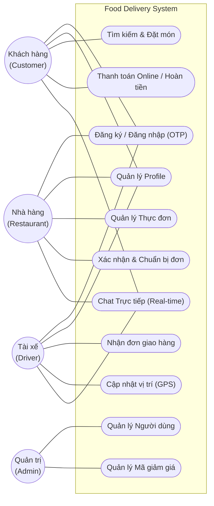
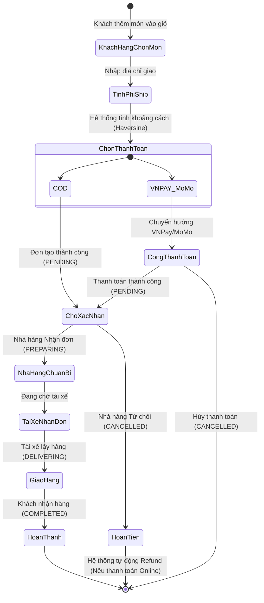
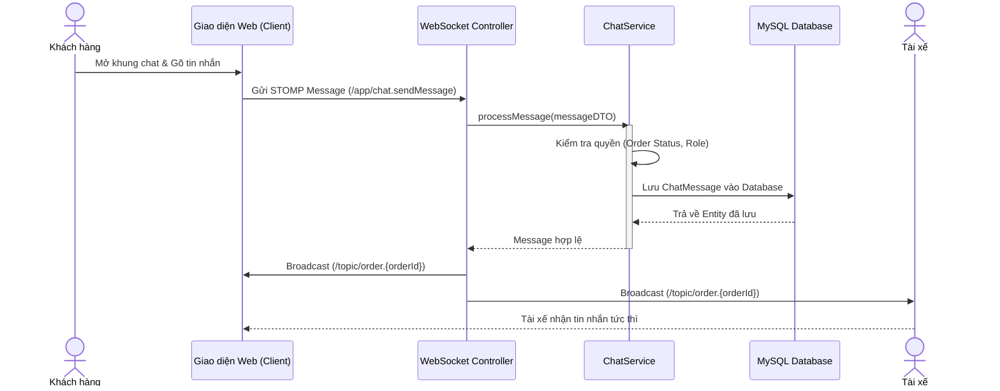
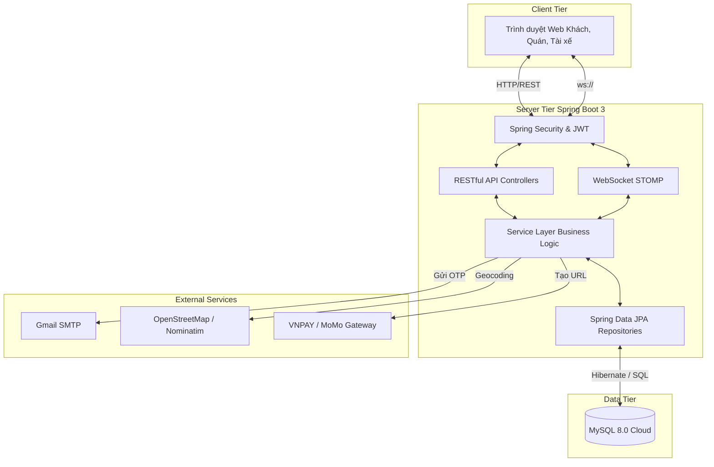

# Tổng hợp các Sơ đồ UML (Mã Mermaid)

> **Hướng dẫn sử dụng với Draw.io:**
> Bạn có thể copy trực tiếp các đoạn mã Mermaid dưới đây, vào Draw.io chọn **Arrange -> Insert -> Advanced -> Mermaid...** (hoặc **Sắp xếp -> Chèn -> Nâng cao -> Mermaid...**), dán mã vào và Draw.io sẽ tự động vẽ ra hình cho bạn!

---

### 1. Sơ đồ Use Case Tổng quát (General Use Case Diagram)
*Mô tả: Thể hiện tương tác giữa 4 Actor (Khách hàng, Nhà hàng, Tài xế, Quản trị viên) với các tính năng chính của hệ thống.*

---

### 2. Sơ đồ Luồng Hoạt động (Activity Diagram) - Luồng Đặt món & Thanh toán
*Mô tả: Luồng xử lý chi tiết từ lúc Khách hàng đặt món, hệ thống tính phí, chọn thanh toán VNPAY/MoMo cho đến khi Nhà hàng xác nhận hoặc Hủy (hoàn tiền).*

---

### 3. Sơ đồ Tuần tự (Sequence Diagram) - Luồng Chat Real-time
*Mô tả: Mô tả cách WebSocket (STOMP) hoạt động khi Khách hàng và Tài xế chat trực tiếp với nhau, bao gồm quá trình phân quyền và lưu trữ.*

---

### 4. Sơ đồ Triển khai Kiến trúc (Deployment / Architecture Diagram)
*Mô tả: Cấu trúc hệ thống 3-tier, giao tiếp với các dịch vụ bên ngoài như Email SMTP, OpenStreetMap, VNPAY.*

