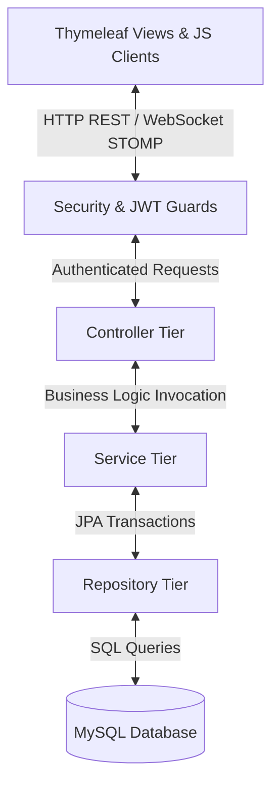

# Project State & Architecture Map

This file acts as the primary "AI memory" regarding the current state of the **Food Delivery System** backend and frontend architectures. It reflects actual code structures, relations, reusable modules, and specific business flows.

---

## 1. Technical Stack

| Category | Technology / Framework | Version / Details | Usage in Code |
| :--- | :--- | :--- | :--- |
| **Core Framework** | Spring Boot | `3.3.0` | Container, MVC, Spring Security, Scheduling, WebSocket, Async |
| **Language** | Java | `17` | Record types, switch patterns, Stream API, sealed types |
| **Database** | MySQL | `8.0` (Aiven MySQL Cloud) | Production relational storage, transactional data persistence |
| **ORM / JPA** | Spring Data JPA / Hibernate | `update` (ddl-auto) | Mapping entity classes (`@Entity`) directly to DB schemas |
| **Security** | Spring Security + JJWT | `0.11.5` | Stateless authentication, token parsing, route guards |
| **Real-time** | Spring WebSocket + STOMP | Simple In-Memory Broker | Real-time chat messaging, order status, and driver GPS streaming |
| **Communications**| JavaMailSender | Gmail SMTP | OTP generation and email account enabling |
| **View Template** | Thymeleaf | Cache disabled in dev | Dynamic rendering with structural layouts |

---

## 2. Architecture & Directory Mapping

The application follows a standard **three-tier architecture** (Controller, Service, Repository) with decoupled security guards and standard entity/DTO representations.



### Key Sub-Folders & Modules:
*   `com.duong.salesmanagement`
    *   [Main.java](file:///d:/review%20SPRING_BOOT/springBoot_template-main/Food_Delivery_System/gs-serving-web-content-main/complete/src/main/java/com/duong/salesmanagement/Main.java): Spring Boot application entry point.
    *   `config/`: Framework and middleware setup (Async, WebSocket, CORS/Web, Database).
    *   `controller/`: REST APIs (`*ApiController.java`) and view controllers (`*ViewController.java`, `WebController.java`).
    *   `dto/`: Request/Response data transfer objects.
    *   `exception/`: Specialized runtime exceptions (e.g., `ChatAccessDeniedException`, `ChatLockedException`).
    *   `model/`: JPA entities containing relational schema structures and entity configurations.
    *   `repository/`: Spring Data JPA repositories querying the MySQL datasource.
    *   `security/`: Custom security mechanisms (JWT filtering, details providers, STOMP channel interceptors).
    *   `service/`: Decoupled core business services holding transactional logic.
    *   `util/`: General helper utilities (e.g., masking phone numbers).

---

## 3. Major Core Modules

The application is composed of **6 structural modules**:

### 1. Authentication & Security (`auth`)
*   **Role**: Handles JWT authentication, registration, OTP validation via Gmail SMTP, and password resets.
*   **Key Files**:
    *   [AuthController.java](file:///d:/review%20SPRING_BOOT/springBoot_template-main/Food_Delivery_System/gs-serving-web-content-main/complete/src/main/java/com/duong/salesmanagement/controller/AuthController.java) (REST Endpoint)
    *   [AuthService.java](file:///d:/review%20SPRING_BOOT/springBoot_template-main/Food_Delivery_System/gs-serving-web-content-main/complete/src/main/java/com/duong/salesmanagement/service/AuthService.java) (OTP and registration lifecycle)
    *   [EmailService.java](file:///d:/review%20SPRING_BOOT/springBoot_template-main/Food_Delivery_System/gs-serving-web-content-main/complete/src/main/java/com/duong/salesmanagement/service/EmailService.java) (Gmail integration)
    *   [SecurityConfig.java](file:///d:/review%20SPRING_BOOT/springBoot_template-main/Food_Delivery_System/gs-serving-web-content-main/complete/src/main/java/com/duong/salesmanagement/security/SecurityConfig.java) (HTTP Firewall and Route Filters)
    *   [JwtUtil.java](file:///d:/review%20SPRING_BOOT/springBoot_template-main/Food_Delivery_System/gs-serving-web-content-main/complete/src/main/java/com/duong/salesmanagement/security/JwtUtil.java) & [JwtAuthenticationFilter.java](file:///d:/review%20SPRING_BOOT/springBoot_template-main/Food_Delivery_System/gs-serving-web-content-main/complete/src/main/java/com/duong/salesmanagement/security/JwtAuthenticationFilter.java)

### 2. User Profiles (`profile`)
*   **Role**: Manages multi-role profile details (Customer, Restaurant, Driver) with unique relationships.
*   **Key Files**:
    *   [ProfileApiController.java](file:///d:/review%20SPRING_BOOT/springBoot_template-main/Food_Delivery_System/gs-serving-web-content-main/complete/src/main/java/com/duong/salesmanagement/controller/ProfileApiController.java)
    *   [ProfileService.java](file:///d:/review%20SPRING_BOOT/springBoot_template-main/Food_Delivery_System/gs-serving-web-content-main/complete/src/main/java/com/duong/salesmanagement/service/ProfileService.java)
    *   Entities: [CustomerProfile.java](file:///d:/review%20SPRING_BOOT/springBoot_template-main/Food_Delivery_System/gs-serving-web-content-main/complete/src/main/java/com/duong/salesmanagement/model/CustomerProfile.java), [RestaurantProfile.java](file:///d:/review%20SPRING_BOOT/springBoot_template-main/Food_Delivery_System/gs-serving-web-content-main/complete/src/main/java/com/duong/salesmanagement/model/RestaurantProfile.java), [DriverProfile.java](file:///d:/review%20SPRING_BOOT/springBoot_template-main/Food_Delivery_System/gs-serving-web-content-main/complete/src/main/java/com/duong/salesmanagement/model/DriverProfile.java)

### 3. Food Ordering & Cart (`order`)
*   **Role**: Implements the ordering pipeline, distance and shipping calculations, voucher discounts, order updates, driver assignments, customer review scoring, and **Server-Side Pagination** for large datasets.
*   **Key Files**:
    *   [CustomerApiController.java](file:///d:/review%20SPRING_BOOT/springBoot_template-main/Food_Delivery_System/gs-serving-web-content-main/complete/src/main/java/com/duong/salesmanagement/controller/CustomerApiController.java), [RestaurantApiController.java](file:///d:/review%20SPRING_BOOT/springBoot_template-main/Food_Delivery_System/gs-serving-web-content-main/complete/src/main/java/com/duong/salesmanagement/controller/RestaurantApiController.java), [DriverApiController.java](file:///d:/review%20SPRING_BOOT/springBoot_template-main/Food_Delivery_System/gs-serving-web-content-main/complete/src/main/java/com/duong/salesmanagement/controller/DriverApiController.java)
    *   [OrderService.java](file:///d:/review%20SPRING_BOOT/springBoot_template-main/Food_Delivery_System/gs-serving-web-content-main/complete/src/main/java/com/duong/salesmanagement/service/OrderService.java) (Core transactions, Pagination, and Fallback geocoding)
    *   [ShippingCalculationService.java](file:///d:/review%20SPRING_BOOT/springBoot_template-main/Food_Delivery_System/gs-serving-web-content-main/complete/src/main/java/com/duong/salesmanagement/service/ShippingCalculationService.java) (Fee estimation engine)
    *   [GeocodingService.java](file:///d:/review%20SPRING_BOOT/springBoot_template-main/Food_Delivery_System/gs-serving-web-content-main/complete/src/main/java/com/duong/salesmanagement/service/GeocodingService.java) (Nominatim address mapping)
    *   Entities: [FoodOrder.java](file:///d:/review%20SPRING_BOOT/springBoot_template-main/Food_Delivery_System/gs-serving-web-content-main/complete/src/main/java/com/duong/salesmanagement/model/FoodOrder.java), [OrderItem.java](file:///d:/review%20SPRING_BOOT/springBoot_template-main/Food_Delivery_System/gs-serving-web-content-main/complete/src/main/java/com/duong/salesmanagement/model/OrderItem.java), [MenuItem.java](file:///d:/review%20SPRING_BOOT/springBoot_template-main/Food_Delivery_System/gs-serving-web-content-main/complete/src/main/java/com/duong/salesmanagement/model/MenuItem.java), [Voucher.java](file:///d:/review%20SPRING_BOOT/springBoot_template-main/Food_Delivery_System/gs-serving-web-content-main/complete/src/main/java/com/duong/salesmanagement/model/Voucher.java)

### 4. Real-time Live Tracking (`tracking`)
*   **Role**: Handles driver GPS coordinate broadcast, tracking history saving, and customer tracking view.
*   **Key Files**:
    *   [DriverLocationController.java](file:///d:/review%20SPRING_BOOT/springBoot_template-main/Food_Delivery_System/gs-serving-web-content-main/complete/src/main/java/com/duong/salesmanagement/controller/DriverLocationController.java) (GPS publishing via HTTP POST)
    *   [CustomerTrackingController.java](file:///d:/review%20SPRING_BOOT/springBoot_template-main/Food_Delivery_System/gs-serving-web-content-main/complete/src/main/java/com/duong/salesmanagement/controller/CustomerTrackingController.java) (GPS polling endpoint)
    *   [LocationTrackingService.java](file:///d:/review%20SPRING_BOOT/springBoot_template-main/Food_Delivery_System/gs-serving-web-content-main/complete/src/main/java/com/duong/salesmanagement/service/LocationTrackingService.java) (Asynchronous logging to DB)
    *   Entities: [OrderTrackingLocation.java](file:///d:/review%20SPRING_BOOT/springBoot_template-main/Food_Delivery_System/gs-serving-web-content-main/complete/src/main/java/com/duong/salesmanagement/model/OrderTrackingLocation.java)

### 5. Chat & Communication (`chat`)
*   **Role**: Coordinates secure order-based communication between clients, restaurants, and drivers. Includes phone masking logic for privacy.
*   **Key Files**:
    *   [WebSocketChatController.java](file:///d:/review%20SPRING_BOOT/springBoot_template-main/Food_Delivery_System/gs-serving-web-content-main/complete/src/main/java/com/duong/salesmanagement/controller/WebSocketChatController.java) (STOMP chat routing)
    *   [ChatApiController.java](file:///d:/review%20SPRING_BOOT/springBoot_template-main/Food_Delivery_System/gs-serving-web-content-main/complete/src/main/java/com/duong/salesmanagement/controller/ChatApiController.java) (REST polling chat fallback)
    *   [ChatService.java](file:///d:/review%20SPRING_BOOT/springBoot_template-main/Food_Delivery_System/gs-serving-web-content-main/complete/src/main/java/com/duong/salesmanagement/service/ChatService.java) (Validates chat pairs, locks, limits)
    *   [ContactService.java](file:///d:/review%20SPRING_BOOT/springBoot_template-main/Food_Delivery_System/gs-serving-web-content-main/complete/src/main/java/com/duong/salesmanagement/service/ContactService.java) (Generates contact visibility lists based on roles/states)
    *   [PhoneMaskUtil.java](file:///d:/review%20SPRING_BOOT/springBoot_template-main/Food_Delivery_System/gs-serving-web-content-main/complete/src/main/java/com/duong/salesmanagement/util/PhoneMaskUtil.java) (Masking utility `098****321`)
    *   Entities: [ChatMessage.java](file:///d:/review%20SPRING_BOOT/springBoot_template-main/Food_Delivery_System/gs-serving-web-content-main/complete/src/main/java/com/duong/salesmanagement/model/ChatMessage.java)

### 6. Notifications System (`notification`)
*   **Role**: Triggers context-aware notifications, enforces smart deduplication, handles bell updates, and supports **Admin Broadcast Notifications** to targeted roles.
*   **Key Files**:
    *   [NotificationApiController.java](file:///d:/review%20SPRING_BOOT/springBoot_template-main/Food_Delivery_System/gs-serving-web-content-main/complete/src/main/java/com/duong/salesmanagement/controller/NotificationApiController.java)
    *   [NotificationService.java](file:///d:/review%20SPRING_BOOT/springBoot_template-main/Food_Delivery_System/gs-serving-web-content-main/complete/src/main/java/com/duong/salesmanagement/service/NotificationService.java) (Deduplication engine & Broadcast capabilities)
    *   Entities: [Notification.java](file:///d:/review%20SPRING_BOOT/springBoot_template-main/Food_Delivery_System/gs-serving-web-content-main/complete/src/main/java/com/duong/salesmanagement/model/Notification.java)

---

## 4. Architectural Data Flows

### A. Order Placement & Estimation Flow
```
[Customer Client] ──> Cart Checkout Form
                       │ (Includes Items + Delivery Address + Voucher)
                       ▼
[OrderService.createOrder]
 ├── 1. Get Lat/Lng from GeocodingService (OSM Nominatim API)
 ├── 2. Capture snapshots of restaurant & customer locations on the FoodOrder
 ├── 3. Calculate distance (Haversine Formula) via ShippingCalculationService
 ├── 4. Estimate Delivery Fee (15k base + 5k/extra km) & ETA (15m + 2m/km + 5m)
 ├── 5. Apply Split Voucher discount logic (Food Voucher & Shipping Voucher) and enforce usage limits
 ├── 6. Persist order & items inside a unified SQL Transaction
 └── 7. Trigger Notification Service (creates notifications for Customer & Restaurant)
```

### B. Live Driver Tracking Flow
```
[Driver App] ──> (Periodically sends coordinates) ──> POST /api/driver/location
                                                              │
   ┌──────────────────────────────────────────────────────────┘
   ▼
[DriverLocationController]
 ├── 1. Validates ownership: Driver must be active and assigned to that Order
 ├── 2. Maps order's active status (e.g., PENDING/PREPARING/DELIVERING) to TrackingPhase
 ├── 3. Broadcasts GPS payload to client STOMP topic "/topic/tracking/" + orderId
 └── 4. Calls LocationTrackingService.saveTrackingHistory (Async @Async thread)
                                        │
                                        ▼
                   [Database (order_tracking_locations table)]
```

### C. Live Chat Flow
```
[Sender Client] ──> STOMP SEND /app/chat.send (Or fallback REST POST /api/chat/send)
                                     │
   ┌─────────────────────────────────┘
   ▼
[WebSocketChatController / ChatService]
 ├── 1. Validates order state: Order must NOT be COMPLETED or CANCELLED
 ├── 2. Asserts roles allowed to communicate (e.g., Customer ↔ Restaurant on PENDING)
 ├── 3. Saves message securely to Database (chat_messages table)
 ├── 4. Creates a persistent notification for the receiver (NEW_MESSAGE type)
 └── 5. Broadcasts raw Message payload to STOMP topic "/topic/order.{orderId}"
```

---

## 5. Reusable Code Assets

### Reusable Utilities (Backend):
1.  **[PhoneMaskUtil.java](file:///d:/review%20SPRING_BOOT/springBoot_template-main/Food_Delivery_System/gs-serving-web-content-main/complete/src/main/java/com/duong/salesmanagement/util/PhoneMaskUtil.java)**: Masking engine (`mask(String phone)` and `maskIf(String phone, boolean shouldMask)`). Masks phones when order status is closed.
2.  **[ShippingCalculationService.java](file:///d:/review%20SPRING_BOOT/springBoot_template-main/Food_Delivery_System/gs-serving-web-content-main/complete/src/main/java/com/duong/salesmanagement/service/ShippingCalculationService.java)**:
    *   `calculateDistance(double lat1, double lon1, double lat2, double lon2)`: Haversine distance algorithm.
    *   `calculateShippingFee(double distanceKm)`: standard delivery fee engine.
    *   `estimateETA(double distanceKm)`: standard duration generator.
3.  **[GeocodingService.java](file:///d:/review%20SPRING_BOOT/springBoot_template-main/Food_Delivery_System/gs-serving-web-content-main/complete/src/main/java/com/duong/salesmanagement/service/GeocodingService.java)**: `getCoordinates(String address)` maps addresses to lat/lng using Nominatim OSM.

### Shared Frontend Scripts:
1.  **`websocket-manager.js`** (under `static/js/websocket-manager.js`): Coordinates STOMP connection establishment, reconnect rules, headers propagation (JWT Bearer Token), and dynamic subscriptions.
2.  **`tracking-service.js`** & **`map-tracking.js`**: Reusable Leaflet MAP coordinates plotters, custom pin indicators (Driver, Restaurant, Customer), and real-time path drawing.

### Shared Thymeleaf Layouts & Fragments:
1.  **`navbar_customer.html`**: Premium customer header, includes a dynamic notification bell (`notification_bell.html`).
2.  **`chat_widget.html`**: Embedded chat window, reads STOMP / WebSocket queues, dynamically adjusts display states based on contact visibility matrix.
3.  **`customer_layout.html` / `dashboard_layout.html`**: Standard page layout shells holding styling, navigation wrappers, footer fragments, and JavaScript scripts declarations.

---

## 6. Coding Conventions & Standards

*   **Identities (Primary Keys)**:
    *   The `User` entity primary key is a **String-based UUID** (`java.util.UUID.randomUUID().toString()`). All other tables use auto-incremented `Long` keys.
    *   Any mapping pointing to a User MUST use `String` datatype (e.g. `sender_id`, `receiver_id`).
*   **Relational Mapping**:
    *   Entities use standard JPA annotations. Fetch types are explicitly configured (use `FetchType.LAZY` for related tables to avoid memory leaks).
    *   Use `@OneToOne(cascade = CascadeType.ALL)` coupled with `@JoinColumn(name = "user_id")` to relate User details with multi-role profiles.
*   **Transaction Controls**:
    *   Core transactions mutating databases MUST carry `@Transactional` annotations.
    *   Services querying read-only database structures must carry `@Transactional(readOnly = true)`.
*   **REST Responses**:
    *   Do NOT return JPA entities directly over the API tier to prevent circular serialization issues and data leakages. Convert entities to structured Data Transfer Objects (DTOs) (e.g., `ProfileDTO`, `TrackingResponseDTO`, `ChatMessageResponse`).

---

## 7. Known Architectural Risks & Anti-Patterns

### 🚨 Critical Vulnerability (Security Risk):
*   **Chat Eavesdropping via STOMP Subscription**:
    *   In `WebSocketAuthInterceptor.preSend()`, the `validateSubscription()` method only implements access checks for destinations starting with `/topic/tracking/`.
    *   It **does not validate** subscriptions to `/topic/order.{orderId}` (the live chat topic).
    *   Any authenticated user can subscribe to `/topic/order.{orderId}` and read all live chat messages for that order.

### ✅ API Blocking Risk Resolved (External Integration):
*   **User-Agent Header on Geocoding Request**:
    *   `GeocodingService.getCoordinates()` performs a REST call via `RestTemplate.getForObject` to Nominatim's search endpoint.
    *   This has been resolved by appending the `FoodDeliveryApp/1.0` User-Agent header, preventing server blockades.

### 🔄 Circular Dependency (Technical Debt):
*   **OrderService ↔ WebSocket Framework Circular Dependency**:
    *   `OrderService` depends on `SimpMessagingTemplate` to broadcast status updates.
    *   `WebSocketConfig` depends on `WebSocketAuthInterceptor` which in turn depends on `OrderService` to validate tracking permissions.
    *   This circle is temporarily solved via a `@Lazy` annotation inside `WebSocketAuthInterceptor`'s constructor. This should be decoupled using an event-driven mechanism (e.g., Spring `ApplicationEventPublisher`).

### 🗑️ Dead / Deprecated Code:
*   **[OrderContactService.java](file:///d:/review%20SPRING_BOOT/springBoot_template-main/Food_Delivery_System/gs-serving-web-content-main/complete/src/main/java/com/duong/salesmanagement/service/OrderContactService.java)**:
    *   This class is a thin wrapper that delegates calls directly to `ContactService.getContactInfo()`. It represents legacy code and should be removed.

---

## 8. Areas AI is Forbidden to Modify

> [!WARNING]
> To prevent application crashes and regression loops, the AI coding assistant MUST NOT modify the following elements:
> 1. **User primary key type**: Do not change `User.id` from `String` to `Long`. This will break all JPA bindings, chat mappings, and existing MySQL data.
> 2. **Authentication Guards**: Do not alter `JwtAuthenticationFilter` or security chain settings in `SecurityConfig` without explicit, specialized tasks.
> 3. **Thymeleaf Layout Fragment IDs**: Do not change the `id` tags of fragment layouts (`navbar_customer`, `notification_bell`, `chat_widget`) because their scripts heavily rely on these specific selectors to update UI components.
