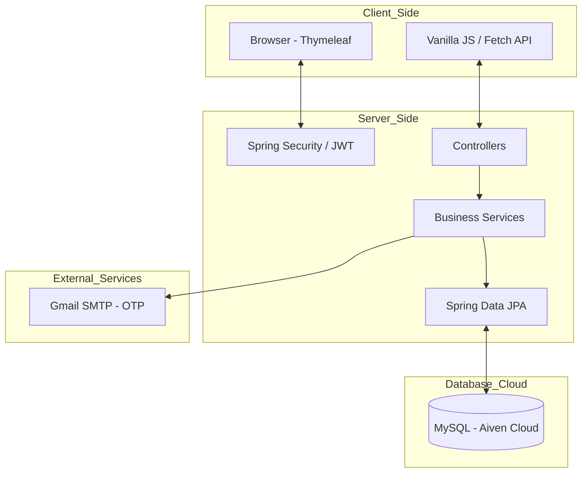

# 🍔 Food Delivery Management System

[](https://spring.io/projects/spring-boot)
[](https://www.oracle.com/java/)
[](https://www.mysql.com/)
[](LICENSE)

---

## 📌 Giới thiệu Dự án

Hệ thống **Food Delivery Management** là một giải pháp toàn diện kết nối **Khách hàng**, **Nhà hàng** và **Tài xế (Shipper)**. Dự án được xây dựng trên nền tảng **Spring Boot 3.3**, tập trung vào sự ổn định, hiệu năng cao và trải nghiệm người dùng hiện đại với giao diện Dashboard thông minh.

---

## 🏗️ Kiến trúc Hệ thống



---

## ⚙️ Chức năng Chính (Use Cases)

Hệ thống đã hoàn thiện **20/20 Use Case (100%)** chia cho 4 nhóm người dùng:

### 👤 Khách hàng (Customer)
-   **Tìm kiếm & Đặt hàng:** Search thông minh, filter nhà hàng, giỏ hàng Real-time (LocalStorage).
-   **Theo dõi đơn hàng:** Tracking Timeline với chế độ tự động cập nhật mỗi 15 giây.
-   **Đánh giá:** Gửi feedback và số sao sau khi nhận hàng.

### 🏪 Nhà hàng (Restaurant)
-   **Quản lý thực đơn:** CRUD món ăn chuyên nghiệp, upload hình ảnh banner/món ăn.
-   **Quản lý đơn hàng:** Tiếp nhận, chế biến và bàn giao cho tài xế với flow mượt mà.
-   **Dashboard:** Thống kê doanh thu trực quan bằng **Chart.js** (Bar & Doughnut charts).

### 🛵 Tài xế (Driver)
-   **Nhận đơn:** Xem danh sách các đơn hàng đang chờ và nhận đơn theo khu vực.
-   **Giao hàng:** Cập nhật trạng thái "Đang giao" và "Hoàn thành". Thu nhập tự động tính 10% phí ship.

### 🛡️ Quản trị viên (Admin)
-   **Quản trị:** Khóa/mở tài khoản, duyệt đối tác nhà hàng mới.
-   **Khuyến mãi:** Hệ thống Voucher linh hoạt (giảm % hoặc số tiền cố định).

---

## 🛠️ Stack Công nghệ

| Thành phần | Công nghệ sử dụng |
| :--- | :--- |
| **Backend** | Java 17, Spring Boot 3.3.0, Spring Data JPA |
| **Bảo mật** | Spring Security, JWT (Stateless), OTP Email Verification |
| **Database** | MySQL 8 (Aiven Cloud / Local), Hibernate |
| **Frontend** | Thymeleaf, Bootstrap 5.3, Vanilla JS, Chart.js |
| **Email** | Gmail SMTP Server |

---

## 🚀 Hướng dẫn Chạy Dự án

### 1. Yêu cầu Hệ thống
- **Java JDK 17** trở lên.
- **Maven 3.8+**.
- **MySQL** (Hoặc dùng database cloud đã cấu hình sẵn).

### 2. Clone & Cài đặt
```bash
git clone https://github.com/DNTt30/Food_Delivery_System.git
cd Food_Delivery_System/gs-serving-web-content-main/complete
```

### 3. Khởi chạy
Sử dụng Maven Wrapper:
```powershell
# Windows
.\mvnw spring-boot:run

# Linux/MacOS
./mvnw spring-boot:run
```

### 4. Truy cập
👉 [http://localhost:8080](http://localhost:8080)

---

## 📁 Cấu trúc Project chính

```text
src/main/java/com/duong/salesmanagement/
├── controller/     # API Endpoints & Web Controllers
├── model/          # Entities (User, Order, MenuItem...)
├── service/        # Business Logic & Email Service
├── repository/     # Data Access Layer (JPA)
└── security/       # JWT & Security Configuration
```

---

## 👨‍💻 Đội ngũ Phát triển

| Thành viên | MSSV | Vai trò |
| :--- | :--- | :--- |
| **Dương Ngọc Tú** | 22010052 | Fullstack Developer / Team Lead |
| **Đinh Thị Như Quỳnh** | 23010844 | Frontend Developer / Documentation |
| **Ngô Minh Quân** | 23017112 | Backend Developer / Database |

---

## 📝 Nhật ký Cập nhật Gần đây

### 📅 08/05/2026
- **Hoàn thiện 100% Use Cases:** Tích hợp đầy đủ các chức năng từ Admin đến Shipper.
- **Nâng cấp Dashboard:** Sử dụng Chart.js cho các biểu đồ thống kê chuyên nghiệp.
- **Tối ưu UI/UX:** Tinh chỉnh layout, header/footer đồng bộ và hiệu ứng loading.
- **Bảo mật:** Hoàn thiện luồng OTP qua Gmail và phân quyền JWT chặt chẽ.
- **Kiến trúc:** Cập nhật sơ đồ kiến trúc hệ thống và luồng dữ liệu JWT.

---
*Dự án thuộc học phần thực hành Phát triển ứng dụng Web.*
