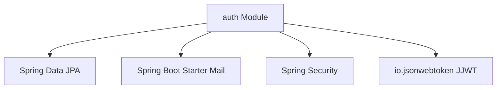

# Module: Authentication & Authorization (auth)

## 1. Purpose
The `auth` module coordinates secure, stateless user operations. It handles dynamic registration, generates and delivers 6-digit OTP verification codes via Gmail, controls token authentication, parses requests via security filters, and permits password recovery.

---

## 2. Public API Endpoints

All endpoints are configured in [AuthController.java](file:///d:/review%20SPRING_BOOT/springBoot_template-main/Food_Delivery_System/gs-serving-web-content-main/complete/src/main/java/com/duong/salesmanagement/controller/AuthController.java):

| HTTP Method | Route Path | Request Payload | Response | Description |
| :--- | :--- | :--- | :--- | :--- |
| `POST` | `/api/auth/register` | `RegisterRequest` | `ResponseEntity<?>` | Registers a new user, hashes password, saves `enabled=false`, dispatches email OTP. |
| `POST` | `/api/auth/verify` | `VerifyRequest` | `ResponseEntity<?>` | Checks OTP code and expiry. Sets `enabled=true`. |
| `POST` | `/api/auth/login` | `AuthRequest` | `AuthResponse` | Validates credentials, issues JWT bearer token. |
| `POST` | `/api/auth/forgot-password` | `ResetPasswordRequest` | `ResponseEntity<?>` | Dispatches recovery OTP to user email. |
| `POST` | `/api/auth/reset-password` | `VerifyRequest` | `ResponseEntity<?>` | Updates user's password following correct OTP input. |

---

## 3. State Management & Lifecycle

*   **Stateless JWT Model**: The server does not maintain session states. Credentials authentication relies on bearer JWT headers included in client headers.
*   **OTP Verification Lifecycle**:
    1.  Registration triggers OTP generation (`String.format("%06d", new java.util.Random().nextInt(1000000))`).
    2.  User state sets `enabled=false`. OTP expiry is timestamped to `LocalDateTime.now().plusMinutes(15)`.
    3.  Verification matches input. On success, `enabled` sets to `true`, and verification fields are wiped.
    4.  OTP expires after 15 minutes. Verification requests past this threshold fail.

---

## 4. Reusable Logic & Security Assets

1.  **[JwtUtil.java](file:///d:/review%20SPRING_BOOT/springBoot_template-main/Food_Delivery_System/gs-serving-web-content-main/complete/src/main/java/com/duong/salesmanagement/security/JwtUtil.java)**: Shared parsing engine used to create, extract, and validate JWT credentials.
2.  **[JwtAuthenticationFilter.java](file:///d:/review%20SPRING_BOOT/springBoot_template-main/Food_Delivery_System/gs-serving-web-content-main/complete/src/main/java/com/duong/salesmanagement/security/JwtAuthenticationFilter.java)**: Intercepts incoming requests, extracts tokens, and populates Spring `SecurityContextHolder`.
3.  **[EmailService.java](file:///d:/review%20SPRING_BOOT/springBoot_template-main/Food_Delivery_System/gs-serving-web-content-main/complete/src/main/java/com/duong/salesmanagement/service/EmailService.java)**: Reusable notification channel to dispatch asynchronous emails.

---

## 5. Dependencies

---

## 6. Known Bugs & Code Limitations

*   **Blocking SMTP Thread**: `EmailService.sendEmail()` executes synchronously on the request dispatcher thread. If Gmail SMTP lags, the API response is delayed, blocking resources.
    *   *Refactor Proposal*: Mark `sendEmail()` with `@Async` to dispatch emails concurrently.
*   **OTP Expiry Check Bug**: If an expired OTP is checked, the system alerts expiry, but there is no scheduled cleaner for stale unverified accounts, creating database noise.

---

## 7. Future Risks

*   **Hardcoded SMTP Passwords**: Properties like password hashes are written inside `application.properties` which is checked into version control.
    *   *Mitigation*: Relocate values to dynamic environment variables in production.

---

## 8. Related Components & Templates

*   `templates/common/auth.html`: Primary login view interface.
*   `static/register.html` & `static/forgot-password.html`: Static registration/recovery widgets.
