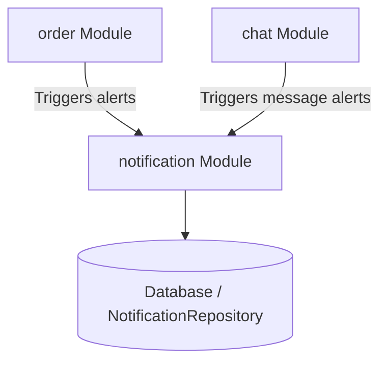

# Module: Notification Alerts (notification)

## 1. Purpose
The `notification` module manages system alerts and dynamic notifications. It keeps users informed of order status changes, driver assignments, delivery completions, reviews, and new chat messages, using dynamic badges and database-persisted alerts.

---

## 2. Public API Endpoints

Managed via [NotificationApiController.java](file:///d:/review%20SPRING_BOOT/springBoot_template-main/Food_Delivery_System/gs-serving-web-content-main/complete/src/main/java/com/duong/salesmanagement/controller/NotificationApiController.java):

| HTTP Method | Route Path | Request Payload | Response | Description |
| :--- | :--- | :--- | :--- | :--- |
| `GET` | `/api/notifications` | None | `List<Notification>` | Returns the latest 50 notifications for the current user. |
| `GET` | `/api/notifications/unread-count` | None | `Long` | Returns count of unread notifications. |
| `PUT` | `/api/notifications/{id}/read` | None | `ResponseEntity<?>` | Marks a specific notification as read (validates ownership). |
| `PUT` | `/api/notifications/read-all` | None | `ResponseEntity<?>` | Marks all notifications for the current user as read. |

---

## 3. Smart Deduplication & Caps

To prevent user fatigue and database bloat, the module enforces smart transaction rules:

*   **Anti-Spam Deduplication (Smart Dedup)**:
    *   Before creating an alert, the system checks if an unread notification of the same type already exists for the order:
        `existsByUserAndTypeAndRelatedOrderIdAndReadFalse(user, type, relatedOrderId)`.
    *   If a duplicate exists, the creation request is ignored, preventing duplicate alerts for rapid status updates.
    *   *Exception*: Chat messages bypass this check, ensuring every message triggers a separate notification.
*   **Database Retention Cap**:
    *   `NotificationService.getNotificationsByUser()` limits queries to the **50 most recent records** using PageRequest:
        `PageRequest.of(0, 50)`.

---

## 4. Notification Types

Defined in [NotificationType.java](file:///d:/review%20SPRING_BOOT/springBoot_template-main/Food_Delivery_System/gs-serving-web-content-main/complete/src/main/java/com/duong/salesmanagement/model/NotificationType.java):

| Notification Type | Trigger Event | Destination Target Role |
| :--- | :--- | :--- |
| `ORDER_CREATED` | Order checked out successfully | Customer / Restaurant Partner |
| `ORDER_ACCEPTED`| Restaurant accepts order | Customer |
| `ORDER_CANCELLED`| Order canceled by restaurant/customer | Customer / Restaurant Partner |
| `DRIVER_ASSIGNED`| Driver claims order | Customer / Restaurant Partner |
| `ORDER_COMPLETED`| Driver completes delivery | Customer / Driver (Earnings alert) |
| `NEW_REVIEW` | Customer submits rating | Restaurant Partner |
| `NEW_MESSAGE` | Dynamic chat message received | Message Receiver (Bypasses Dedup) |
| `SYSTEM_ALERT` | General administrator announcements | Targeted Users |

---

## 5. Dependencies

---

## 6. Known Bugs & Code Limitations

*   **Missing WebSocket Broadcast**: Notifications are currently saved to the database but **not broadcast in real-time** via WebSockets. Users must refresh their browser or trigger polling to see badge updates.
    *   *Refactor Proposal*: Inject `SimpMessagingTemplate` into `NotificationService` and broadcast unread counts to `/topic/notifications.{userId}` on update.
*   **Missing Hard Cleaner**: There is no scheduled database cleanup task. Stale read notifications accumulate indefinitely in the `notifications` table.

---

## 7. Future Risks

*   **DB Scale Bloat**: As order volume grows, millions of historical notifications will slow down queries.
    *   *Mitigation*: Implement a scheduled Spring task (`@Scheduled`) to clean up notifications older than 30 days.

---

## 8. Related Components & Templates

*   `templates/fragments/notification_bell.html`: Renders the navbar bell icon and dynamic unread badge.
*   `templates/fragments/scripts.html`: Runs the JavaScript polling script to update unread badge counts in the UI.
