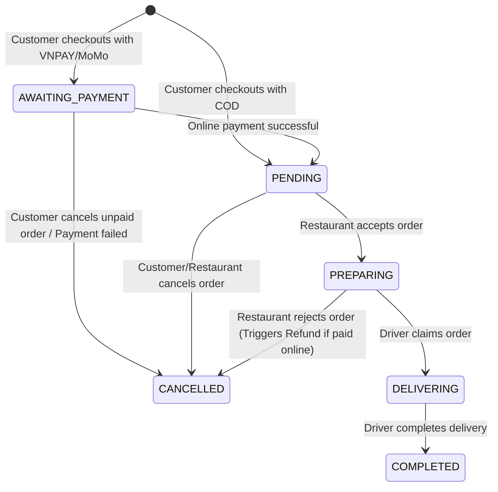
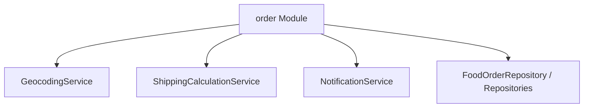

# Module: Food Ordering System (order)

## 1. Purpose
The `order` module is the core business engine. It coordinates order creation, estimates distances and shipping fees, computes ETA durations, processes voucher discounts, handles state updates, matches driver assignments, and processes review ratings.

---

## 2. Public API Endpoints

Coordinates business logic through multi-role controllers:

### A. Customer Endpoints ([CustomerApiController.java](file:///d:/review%20SPRING_BOOT/springBoot_template-main/Food_Delivery_System/gs-serving-web-content-main/complete/src/main/java/com/duong/salesmanagement/controller/CustomerApiController.java))
*   `POST /api/customer/orders`: Creates a new order. Triggers fee calculations, estimates delivery times, validates vouchers, and records item purchases.
*   `POST /api/customer/orders/{orderId}/cancel`: Cancels PENDING orders.
*   `POST /api/customer/orders/{orderId}/review`: Submits reviews for COMPLETED orders, updating the restaurant's rating.

### B. Restaurant Endpoints ([RestaurantApiController.java](file:///d:/review%20SPRING_BOOT/springBoot_template-main/Food_Delivery_System/gs-serving-web-content-main/complete/src/main/java/com/duong/salesmanagement/controller/RestaurantApiController.java))
*   `PUT /api/restaurant/orders/{orderId}/status`: Triggers order state transitions (accepts as `PREPARING` or rejects as `CANCELLED`).

### C. Driver Endpoints ([DriverApiController.java](file:///d:/review%20SPRING_BOOT/springBoot_template-main/Food_Delivery_System/gs-serving-web-content-main/complete/src/main/java/com/duong/salesmanagement/controller/DriverApiController.java))
*   `GET /api/driver/orders/available`: Lists unclaimed orders with `PREPARING` status.
*   `POST /api/driver/orders/{orderId}/accept`: Driver claims order, changing status to `DELIVERING`.
*   `POST /api/driver/orders/{orderId}/complete`: Marks order as `COMPLETED`.

---

## 3. Order Pipeline & State Transitions

The order state transitions follow a strict pipeline, now including online payment flows (VNPAY/MoMo):

---

## 4. Reusable Calculation Engines

1.  **[ShippingCalculationService.java](file:///d:/review%20SPRING_BOOT/springBoot_template-main/Food_Delivery_System/gs-serving-web-content-main/complete/src/main/java/com/duong/salesmanagement/service/ShippingCalculationService.java)**:
    *   `calculateDistance(double lat1, double lon1, double lat2, double lon2)`: Haversine distance formula.
    *   `calculateShippingFee(double distanceKm)`: Standard shipping fee structure (15k base for 3km, +5k per extra km, max 75k).
    *   `estimateETA(double distanceKm)`: standard duration generator (15m prep + 2m/km + 5m buffer).
2.  **[GeocodingService.java](file:///d:/review%20SPRING_BOOT/springBoot_template-main/Food_Delivery_System/gs-serving-web-content-main/complete/src/main/java/com/duong/salesmanagement/service/GeocodingService.java)**: Converts address strings to coordinates (lat/lng) using Nominatim OpenStreetMap API.
3.  **Security Checks**: `orderService.hasPermissionToTrackOrder(orderId, user)` checks role-based access rights, preventing unauthorized order data leaks.

---

## 5. Dependencies

---

## 6. Known Bugs & Code Limitations

*   **Synchronous Nominatim Calls**: Geocoding queries are performed synchronously inside `createOrder()`. If Nominatim's server is slow, the entire checkout process lags, blocking database connection pool resources.
*   **Voucher Expiration Vulnerability**: The voucher validation checks dates using `LocalDate.now()` but does not account for time zones, which can cause inconsistent validation results near midnight.
*   **[RESOLVED] Nominatim User-Agent Blocking Risk**: Nominatim requires a user-agent header. This is resolved by adding a custom `User-Agent` header (`FoodDeliveryApp/1.0`) to the HTTP request in `GeocodingService.java` to prevent 403 Forbidden blocking errors.

---

## 7. Future Risks

*   **Floating-Point Inaccuracy**: Monetary calculations use `Double` rather than `BigDecimal`, which can lead to minor precision losses when calculating totals or voucher discounts in production.
    *   *Mitigation*: Migrate pricing attributes to `BigDecimal` or use integer types representing VND directly.

---

## 8. Related Components & Templates

*   `templates/customer/cart.html`: Cart view and checkout.
*   `templates/customer/detail.html`: Displays order summary.
*   `templates/restaurant/orders.html` & `templates/driver/new_orders.html`: Dynamic order workspaces.
