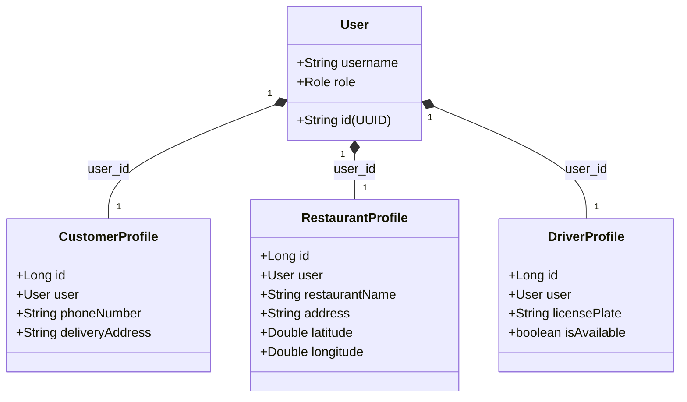

# Module: User Profiles (profile)

## 1. Purpose
The `profile` module maintains role-specific metadata. Rather than cluttering the central `User` credentials entity with role-specific attributes (like license plates, addresses, or ratings), it decouples details into specialized tables connected via JPA relationships.

---

## 2. Public API Endpoints

Managed via [ProfileApiController.java](file:///d:/review%20SPRING_BOOT/springBoot_template-main/Food_Delivery_System/gs-serving-web-content-main/complete/src/main/java/com/duong/salesmanagement/controller/ProfileApiController.java):

| HTTP Method | Route Path | Request Payload | Response | Description |
| :--- | :--- | :--- | :--- | :--- |
| `GET` | `/api/profile` | None (Token authenticated) | `ProfileDTO` | Extracts user info from the JWT token and returns their profile details. |
| `PUT` | `/api/profile` | `ProfileDTO` | `ProfileDTO` | Updates specific details based on user role (e.g. phone, address). |
| `PUT` | `/api/profile/change-password` | `PasswordChangeDTO` | `ResponseEntity<?>` | Secure credentials modification. |

---

## 3. State Management & Entities

Profiles represent distinct Hibernate tables that map directly to standard SQL entities:

### Cascade Rules:
Profiles utilize `@OneToOne(cascade = CascadeType.ALL)` links. Deleting or modifying a `User` entity cascades changes directly to their corresponding role profile.

---

## 4. Reusable Logic & Security Assets

*   **Role-Guided Profile Resolving**: [ProfileService.java](file:///d:/review%20SPRING_BOOT/springBoot_template-main/Food_Delivery_System/gs-serving-web-content-main/complete/src/main/java/com/duong/salesmanagement/service/ProfileService.java) dynamically detects the client role and maps custom profiles into a unified `ProfileDTO` structure, providing a clean abstraction for the frontend.
*   **Security Ownership Checks**: Every update asserts profile ownership by comparing the authenticated token identity with the entity's UUID, preventing cross-profile modifications.

---

## 5. Dependencies

*   **JPA Persistence Tier**: Relies on `CustomerProfileRepository`, `DriverProfileRepository`, and `RestaurantProfileRepository`.
*   **Auth Module**: Depends on `AuthService` and `JwtUtil` to resolve active session identities.

---

## 6. Known Bugs & Code Limitations

*   **Lack of Phone Validation**: Profile creation and modification do not perform format validations (e.g. checks for 10-digit formats). This creates risks of broken formatting in SMS or chat contexts.
*   **[RESOLVED] Address Geocode Sync**: Previously, updating addresses left coordinates out of sync. This is now resolved:
    1. The Profile page (`profile.html` for Customers & Restaurants) incorporates a Leaflet Map Picker that auto-saves exact `latitude` and `longitude` coordinates directly to the database upon location confirmation.
    2. During checkout, if coordinates are missing, `OrderService.createOrder()` automatically queries Nominatim API and persists the resolved coordinates back to the respective Profile repository.

---

## 7. Future Risks

*   **Dynamic Role Transitioning**: If a user role changes (e.g. customer becomes a driver), the existing profile record remains in the database.
    *   *Mitigation*: Restrict role modifications in production.

---

## 8. Related Components & Templates

*   `templates/common/profile.html`: Integrated double-column customer profile interface.
*   `templates/restaurant/profile.html`: standalone restaurant partner profile.
*   `fragments/navbar_customer.html`: references user's full name via session tags.
